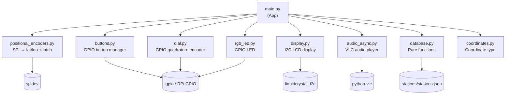

# RadioGlobe Architecture

This document is a guide for developers joining the project. It explains the physical hardware, how the software maps onto it, and what each module does. It also surfaces concrete improvement suggestions to make the code easier to maintain and extend.

This is not the setup guide — that's [README.md](README.md). For a brief asyncio design sketch, see [docs/DESIGN.md](docs/DESIGN.md).

---

## Table of Contents

1. [What RadioGlobe Is — Physical Context](#1-what-radioglobe-is--physical-context)
2. [Repository Layout](#2-repository-layout)
3. [Architecture Overview](#3-architecture-overview)
4. [Module Reference](#4-module-reference)
5. [Key Data Flows](#5-key-data-flows)
6. [State Management](#6-state-management)
7. [Concurrency Model](#7-concurrency-model)
8. [Configuration Reference](#8-configuration-reference)
9. [Testing](#9-testing)
10. [Suggested Improvements](#10-suggested-improvements)
11. [What's Already Good](#11-whats-already-good)

---

## 1. What RadioGlobe Is — Physical Context

Before the code makes sense, you need to picture the object.

A physical globe sits in a cradle. The cradle has a pivoting reticule — a crosshair arm — that the user positions over any point on the globe's surface. Two 10-bit absolute rotary encoders read the reticule's latitude and longitude as integer values from 0 to 1023. There is no "home position" — the encoders are absolute, not incremental, so they survive power cycles without recalibration (as long as the globe hasn't been physically moved).

Spinning the globe to point at London causes the software to look up London's radio stations and start playing one. A rotary dial on the base lets the user cycle through stations or cities. Four push-buttons handle volume, calibration, and power. A 20×4 character LCD and an RGB LED provide feedback.

The Raspberry Pi 4B runs Raspberry Pi OS Bookworm Lite. Audio plays through VLC via either the 3.5mm jack or Bluetooth.

### Hardware-to-Module Mapping

| Physical Component | Interface | GPIO / Address | Module |
|---|---|---|---|
| Globe reticule encoders (lat, lon) | SPI bus 0, devices 0 & 1 | — | `positional_encoders.py` |
| Station/city select dial | GPIO quadrature | Pins 17 (clock), 18 (direction) | `dial.py` |
| Jog button (mode toggle) | GPIO | Pin 27 | `buttons.py` |
| Top button (volume up) | GPIO | Pin 5 | `buttons.py` |
| Mid button (calibrate / shutdown) | GPIO | Pin 6 | `buttons.py` |
| Bottom button (volume down) | GPIO | Pin 12 | `buttons.py` |
| 20×4 character LCD | I2C | Bus 1, address 0x27 | `display.py` |
| RGB status LED | GPIO | R=22, G=23, B=24 | `rgb_led.py` |
| Audio output | VLC / PulseAudio | 3.5mm / Bluetooth | `audio_async.py` |

### Button Operations

| Button | Short Press | Long Press |
|---|---|---|
| **Jog** (27) | Toggle station / city mode | — |
| **Top** (5) | Volume +10 | Set volume to 80 |
| **Mid** (6) | Calibrate encoders to 0,0 | Shutdown (`sudo poweroff`) |
| **Bottom** (12) | Volume −10 | Mute (volume to 0) |

---

## 2. Repository Layout

```
RadioGlobe/
├── radioglobe/                       # Python application package
│   ├── main.py                       # App class: entry point and main loop
│   ├── radio_config.py               # Configuration constants (see caveat in §8)
│   ├── database.py                   # Pure functions: station/city spatial index
│   ├── coordinates.py                # Coordinate value object (lat/lon → display string)
│   ├── audio_async.py                # AudioPlayer: wraps python-vlc directly
│   ├── display.py              # 20×4 I2C LCD driver
│   ├── dial.py                 # Quadrature encoder for station/city selection
│   ├── dial_button.py (deleted)          # Combined dial + button (historical, unused in prod)
│   ├── positional_encoders.py  # SPI encoders → lat/lon + latch mechanism
│   ├── buttons.py              # Multi-button manager with short/long press
│   ├── rgb_led.py              # RGB LED flash controller
│   └── streaming/                    # Lab: historical streaming implementations
│       ├── streaming.py              # Oldest: subprocess + amixer volume
│       ├── streaming_cvlc.py         # cvlc subprocess wrapper (used in test scripts)
│       ├── python_vlc_streaming.py   # python-vlc Streamer class (informed audio_async.py)
│       ├── async_streamer.py         # Experimental: async playlist resolver via aiohttp
│       └── files.py                  # JSON loader helper for test scripts
│
├── tests/                            # Mix of unit tests and hardware integration scripts
│   ├── get_stations_by_city_test.py  # Unit tests (run without hardware)
│   ├── simulation_test.py            # Integration: requires Pi hardware
│   ├── async_streamer_test.py        # Integration: requires network
│   └── ...                           # Other hardware / manual test scripts
│
├── stations/
│   └── stations.json                 # Radio station database (~705 KB, 500+ cities)
│
├── services/
│   └── radioglobe.service            # systemd user service definition
│
├── docs/
│   └── DESIGN.md                     # Asyncio design notes
│
├── board/                            # PCB Gerber files and schematics
├── pyproject.toml                    # Package config and dev dependencies
├── requirements.txt                  # Runtime dependencies (includes git-sourced packages)
├── Makefile                          # Build, deploy, release targets
└── install.sh                        # Installation script for Raspberry Pi
```

**Key notes:**
- `streaming/` is a development lab. The production audio code is `audio_async.py`, which does not import from `streaming/`.
- `tests/` contains both proper unit tests (runnable on any machine) and hardware integration scripts. They are not yet separated — see [Improvement 11](#improvement-11-separate-integration-test-scripts).

---

## 3. Architecture Overview

The application is a single-process asyncio program. One event loop runs on the main thread, and all hardware I/O runs as asyncio Tasks or is bridged into the loop from GPIO interrupt threads.

**The central concept is the reticule position.** Every 100ms the main loop reads the encoder position, searches the spatial city index for any city near that position, and if one is found, starts playing its radio stream. The dial and buttons adjust the experience once a city is latched.

**Two operating modes** are toggled by the jog button:
- `station` mode — the dial cycles through stations within the current city
- `city` mode — the dial cycles through other nearby cities, reloading the first station for each

**The latch mechanism** prevents jitter. Once a city is found, the encoder's raw position is frozen until the user moves the reticule more than `STICKINESS` encoder steps away. Without this, the station would change continuously while the user browses with the dial.

### Module Dependency Graph



The `streaming/` directory is intentionally omitted — none of its modules are imported by the main application.

---

## 4. Module Reference

### 4.1 `main.py` — App Controller

The `App` class is the central controller. `__init__` instantiates all hardware objects and loads the station database. `run()` contains the main loop and wires button definitions.

**State** is held in an `AppState` dataclass (`self.state`) with eight fields. `save_state()` uses `dataclasses.asdict(self.state)` for serialisation; `load_state()` reconstructs `AppState(...)` directly from the JSON. On boot, if a saved state is found, the latch is restored and the last station resumes playing immediately (warm-restart path).

**Key methods:**

| Method | Purpose |
|---|---|
| `run()` | Main async loop: poll encoders, search cities, drive display and audio |
| `next_station(direction)` | Cycle `jog_idx` within `self.state.stations` |
| `next_city(direction)` | Cycle `jog_idx` within `self.state.cities`, reload station list |
| `switch_mode()` | Toggle `self.state.mode` between `"station"` and `"city"` |
| `save_state()` | Serialise `AppState` + encoder offsets to `~/cache/radioglobe.json` |
| `load_state()` | Restore state from cache on startup |
| `_get_coords_by_city(city)` | Look up a `Coordinate` for a city string |
| `_find_all_cities(coords, cities)` | Return all city names whose grid coords appear in `coords` |
| `_update_volume(delta)` | Adjust volume by delta, briefly show level on display |
| `_update_volume_level(level)` | Set volume to an absolute level, briefly show on display |
| `_check_stream(expected_url)` | After 3 s, flash red LED and show "Stream error" if VLC failed |
| `_handle_short_jog` / `_handle_long_jog` | Jog button handlers |
| `_handle_short_top` / `_handle_long_top` | Top button handlers |
| `_handle_short_mid` / `_handle_long_mid` | Mid button handlers |
| `_handle_short_bottom` / `_handle_long_bottom` | Bottom button handlers |
| `_on_jog_press` / `_on_sound_press` / `_on_mid_press` | Immediate press-down LED feedback |

**Non-obvious details:**
- `self.state.city` is passed to `display.update()` as a raw string (e.g. `"London,GB"`) but the display formats it directly — no truncation for long city names.
- `save_state()` always writes `"latch": True`; on `load_state()` this causes the app to immediately resume playing the last station on next boot.

---

### 4.2 `database.py` — Station Data

Pure functions with no side effects and no hardware dependencies. The most testable module in the project.

**Functions:**

| Function | Returns | Notes |
|---|---|---|
| `load_stations(path)` | `dict` keyed by `"City,CC"` | Returns empty dict on FileNotFoundError |
| `build_cities_index(stations_data)` | `dict[(lat_idx, lon_idx) → list[city_name]]` | Converts lat/lon degrees to 0–1023 grid indices; multiple cities per cell are supported |
| `look_around(origin, fuzziness)` | `list` of `(lat, lon)` tuples | Returns search zone around a point |
| `get_stations_by_city(stations, city)` | `list` of `(name, url)` tuples | The canonical station list format |
| `get_found_cities(search_area, city_map)` | `list` of city strings | Used in some test scripts; superseded by `find_all_cities` in `main.py` |

**Coordinate formula:** `index = round((degrees + 180) * 1024 / 360)`. This maps −180°→0 and +180°→1024.

**`look_around()` detail:** `fuzziness=1` returns just the origin point; `fuzziness=2` returns 9 points (3×3 area); `fuzziness=3` returns 25 points (5×5 area). The search starts bottom-left and scans horizontally — this matches ergonomics (70% of people are right-eye dominant and hold the globe below eye level).

**Legacy functions** at the bottom of the file (`get_station_by_index`, `get_first_station`, `get_all_urls`, `get_stations_info`) are not used by the main application. They exist for test scripts and older code paths.

---

### 4.3 `positional_encoders.py` — Globe Position

Reads two SPI absolute rotary encoders and maintains the current lat/lon position.

**Key behaviour:**
- Each encoder is read via SPI bus 0, device 0 (latitude) and device 1 (longitude), at 5000 Hz, SPI mode 1.
- Raw readings are 16 bits; the top 10 bits (after shifting right by 6) give the 0–1023 position.
- `check_parity()` validates each reading. If parity fails, the entire read returns `None` and is discarded.
- Latitude is inverted: `readings[0] = ENCODER_RESOLUTION - readings[0]`. This corrects for encoder mounting orientation.

**The latch mechanism:**
- `latch(lat, lon, stickiness)` stores the latched position and sets `latch_stickiness` to the threshold value.
- While latched, `run_encoder()` still reads SPI but only updates `self.latitude`/`self.longitude` if the new reading differs by more than `latch_stickiness` steps. If it does, `latch_stickiness` is set to `None` (unlatched) and reading resumes normally.
- `is_latched()` returns `True` if `latch_stickiness is not None`.

**Calibration:** `zero()` sets offsets so the current physical position maps to (512, 512), which corresponds to 0°N, 0°E (the equator / prime meridian intersection). `get_readings()` always returns the offset-adjusted value modulo ENCODER_RESOLUTION. `reset_latch()` clears `latch_stickiness` so the main loop can re-detect cities after zeroing — `zero()` alone does not clear the latch.

**Note:** The `if __name__ == "__main__":` block at the bottom of this file (lines 109–142) is a hardware test script, not part of the class. It hardcodes `STICKINESS = 10`.

---

### 4.4 `dial.py` — Station / City Selector

Reads a quadrature rotary encoder on GPIO pins 17 (clock) and 18 (direction).

- `run_encoder()` uses `asyncio.to_thread(GPIO.wait_for_edge, pin, GPIO.FALLING)` to avoid blocking the event loop. On each falling edge it reads the direction pin and stores the result (debounced at 300ms).
- `get_direction()` is a one-shot read: it returns the stored direction and resets the internal value to 0. The main loop calls this every 100ms.
- The returned value is inverted (`* -1`) to correct for physical wiring convention. +1 means clockwise, −1 means counter-clockwise.

---

### 4.5 `buttons.py` — Button Manager

Manages four GPIO buttons with short and long press detection.

**Button definition tuple:**
```python
("Name", gpio_pin, short_handler, long_handler, press_callback)
```
- `press_callback` fires immediately on press-down (used for instant LED feedback)
- `short_handler` fires on release if held < 1.0 second
- `long_handler` fires on release if held ≥ 1.0 second

`AsyncButton` uses GPIO fall-edge callbacks that bridge into the asyncio event loop via `loop.call_soon_threadsafe()`. `AsyncButtonManager` holds all buttons, runs a background polling task, and dispatches events via an `asyncio.Queue`.

---

### 4.6 `display.py` — LCD Display

Drives a 20×4 I2C character LCD at address 0x27 on bus 1, using the `liquidcrystal_i2c` library.

- Internally maintains a 4-line text buffer and an `asyncio.Event` (`changed`). When `update()` or `message()` is called, the buffer is updated and the event is set.
- `_display_loop()` is an asyncio Task that waits for the event, writes all 4 lines to the LCD, and sleeps 100ms. This coalesces rapid updates — important because I2C is slow.

**Display layout when playing:**
```
Line 0: 51.50N, 0.13W        ← Coordinate.__str__()
Line 1: London,GB             ← City name
Line 2: --------              ← Volume bar (ASCII dashes, scales 0–100)
Line 3: BBC Radio 2           ← Station name
```

---

### 4.7 `audio_async.py` — Audio Player

Wraps `python-vlc` directly. Does not import from `streaming/`.

```python
class AudioPlayer:
    def __init__(self):
        self.instance = vlc.Instance("--input-repeat=-1")  # infinite repeat
        self.player = self.instance.media_player_new()
```

- `play(city, station)` stops any current playback and starts the new URL immediately. VLC handles playlist URLs (`.m3u`, `.pls`) internally. It also records `current_url` for the stale-check guard in `_check_stream`.
- `--input-repeat=-1` means the stream restarts automatically if the connection drops.
- Volume is managed via VLC's `audio_get_volume` / `audio_set_volume`, range 0–100.
- `is_error()` returns `True` if VLC is in `State.Error` **or** `State.Ended`. Both states indicate failure for a live radio stream: `Error` for codec/protocol failures, `Ended` for HTTP 404 / "input can't be opened".
- Dead-stream detection is handled by `App._check_stream(expected_url)` in `main.py`: it fires 3 s after each `play()`, discards the check if the URL has changed (stale guard), and if the stream has failed it flashes the LED red and shows "Stream error" on the display.

---

### 4.8 `rgb_led.py` — Status LED

Three GPIO output pins (R=22, G=23, B=24) with simple on/off control (no PWM).

`led_task(led, led_running, colour, duration)` is a standalone coroutine, always spawned with `asyncio.create_task()` rather than awaited. It:
1. Checks the `led_running` Event to prevent overlapping flashes
2. Sets the event, turns the LED on
3. Sleeps for `duration` seconds
4. Turns the LED off and clears the event

**Colour conventions used in `main.py`:**
- Green: city found/latched, button press feedback
- Blue: dial turned, volume button press

---

### 4.9 `coordinates.py` — Coordinate Type

A simple value object. `__str__` produces the display format used on the LCD:

```python
>>> str(Coordinate(51.5074, -0.1278))
'51.51N, 0.13W'
```

Equality comparison rounds to 2 decimal places (`ROUNDING = 2`). Used consistently throughout `main.py` and `display.py` — all `display.update()` call sites pass a `Coordinate` object.

---

### 4.10 `radio_config.py` — Configuration

Defines constants for the application. **Warning: many of these are not actually used.** See [§8 Configuration Reference](#8-configuration-reference) for the full discrepancy table.

Also has a side-effect on import: sets up `logging.basicConfig()`. Logging setup should live in `main.py`.

---

### 4.11 `streaming/` — Historical Streaming Implementations

This directory contains four streaming approaches developed over time. None are imported by the production code (`audio_async.py`).

| File | Approach | Status |
|---|---|---|
| `streaming.py` | subprocess + amixer volume | Legacy |
| `streaming_cvlc.py` | `cvlc` CLI subprocess | Used in integration test scripts |
| `python_vlc_streaming.py` | python-vlc with explicit playlist detection | Informed `audio_async.py` design |
| `async_streamer.py` | Async playlist URL resolver using aiohttp | Experimental, not used |
| `files.py` | JSON station loader helper | Used by test scripts |

If you need to understand the audio subsystem, read `audio_async.py`. The `streaming/` directory is useful historical context.

---

## 5. Key Data Flows

### Flow A: Globe Spun to a New City

1. `PositionalEncoders.run_encoder()` reads SPI every 200ms and updates `self.latitude` / `self.longitude` (unless latched).
2. The main loop (100ms sleep) calls `encoders.get_readings()` — returns the offset-adjusted `(lat, lon)` tuple.
3. `look_around(coords, FUZZINESS=2)` generates 9 grid coordinates (3×3) surrounding the current position.
4. `_find_all_cities(zone, self.cities_info)` checks each coordinate against the spatial index dict, flattening the per-cell city lists.
5. If cities are found and the encoders are not already latched:
   - `encoders.latch(*coords, stickiness=STICKINESS)` freezes the position.
   - `jog_idx` and `city_idx` reset to 0.
   - The LED flashes green.
6. `get_stations_by_city(self.stations_info, city)` fetches the station list as `[(name, url), ...]`.
7. `audio_player.play(city, station)` passes the URL to VLC.
8. `display.update(coords, city, 0, station_name, False)` refreshes the LCD.
9. `asyncio.create_task(_check_stream(station_url))` schedules a 3 s deferred check for stream failure.

### Flow B: User Turns the Dial

1. `AsyncDial.run_encoder()` detects a falling edge on GPIO 17, reads direction from GPIO 18.
2. The main loop reads `dial.get_direction()` — non-zero means rotation.
3. The LED flashes blue.
4. If `mode == "station"`: `next_station(direction)` increments/decrements `jog_idx` within `self.stations` (wraps around).
5. If `mode == "city"`: `next_city(direction)` increments/decrements `jog_idx` within `self.cities`, fetches the first station for the new city.
6. `display.update()` and `audio_player.play()` update immediately.

---

## 6. State Management

Application state is held in an `AppState` dataclass on `self.state`:

| Field | Type | Meaning |
|---|---|---|
| `stations` | `list[(name, url)]` | Stations for the current city |
| `station` | `tuple \| None` | Currently playing station |
| `station_idx` | `int` | Index of `station` in `stations` |
| `cities` | `list[str]` | Cities found in the current search zone |
| `city` | `str \| None` | Currently selected city (e.g. `"London,GB"`) |
| `city_idx` | `int` | Index of `city` in `cities` |
| `jog_idx` | `int` | Shared index used by both station and city navigation |
| `mode` | `str` | `"station"` or `"city"` |

Encoder state (lat/lon, offsets, latch) is owned by `PositionalEncoders` on `self.encoders`.

On shutdown (long press of mid button), `save_state()` calls `dataclasses.asdict(self.state)` and appends the encoder offsets and latch flag, writing the result to `~/cache/radioglobe.json`. On the next boot, `load_state()` reconstructs `AppState(...)` from the JSON and sets `latch_stickiness = True` so the app resumes the last station immediately.

**Fragility note:** The saved `stations` and `cities` lists are snapshots. If `stations.json` is updated between boots (e.g. after an install), the saved indices may point to different or non-existent stations. The restore currently uses the saved lists as-is rather than re-querying from `stations_info`.

---

## 7. Concurrency Model

The entire application runs on a single asyncio event loop. Understanding this is essential before modifying any hardware module.

**Tasks running concurrently:**
```python
asyncio.create_task(dial.run_encoder())           # polls GPIO, 300ms debounce
asyncio.create_task(encoders.run_encoder())       # reads SPI every 200ms
asyncio.create_task(display._display_loop())      # writes LCD on change event
asyncio.create_task(button_manager.handle_events()) # dispatches button callbacks
# main while loop sleeps 100ms between iterations
```

**GPIO interrupt bridging:** RPi.GPIO fires button callbacks on a separate interrupt thread. These callbacks call `loop.call_soon_threadsafe(...)` to schedule coroutines back onto the asyncio event loop. This is the correct pattern — do not call `asyncio.create_task()` directly from a GPIO callback thread.

**Blocking calls:** `GPIO.wait_for_edge()` is blocking and is wrapped with `asyncio.to_thread()` in `dial.py`. Any new hardware code that polls with blocking calls must do the same.

**LED tasks** are always `create_task`'d rather than awaited — they are fire-and-forget. The `led_running` Event prevents concurrent flashes.

**What to be careful about:** Do not put any blocking call (file I/O, `time.sleep()`, synchronous network calls) directly in the main loop body. Every blocking call holds up all other hardware tasks.

---

## 8. Configuration Reference

`radio_config.py` is not reliably used. Here is the ground truth:

| Parameter | `radio_config.py` value | Actual value used | Notes |
|---|---|---|---|
| `FUZZINESS` | **2** (current) | Imported in `main.py` | ✓ Imported — value not yet updated to intended 3 |
| `STICKINESS` | **3** (current) | Imported in `main.py` | ✓ Imported — value not yet updated to intended 10 |
| `ENCODER_RESOLUTION` | 1024 | Imported in `database.py` and `positional_encoders.py` | ✓ Centralised |
| `VOLUME_INCREMENT` | 1 | Not used — `main.py` hardcodes delta of 10 | Dead constant |
| GPIO pin numbers | `PIN_DIAL_CLOCK`, `PIN_BTN_*`, `PIN_LED_*` | Imported in each hardware module | ✓ Centralised |
| I2C address | `I2C_LCD_ADDR = 0x27` | Imported in `display.py` | ✓ Centralised |

`FUZZINESS = 2` gives a 9-point (3×3) search zone. The intended operational value of 3 gives a 25-point (5×5) zone and is less likely to miss a city near the edge of the reticule. `STICKINESS = 3` unlatches after just 3 encoder steps (~1°), which can cause jitter. The intended value of 10 is more stable. Since `main.py` now imports both from `radio_config.py`, changing the values there takes effect immediately.

---

## 9. Testing

Unit tests run on any machine. Hardware integration scripts require a connected Raspberry Pi.

**Unit tests (run without hardware):**
```bash
uv run pytest
```
`pyproject.toml` configures `testpaths = ["tests"]` and `norecursedirs = ["integration"]`, so `pytest` finds only the unit tests and skips the hardware scripts automatically.

**Hardware / integration scripts** live in `tests/integration/` and must be run directly on the Pi from the `radioglobe/` directory:

| Script | What it tests |
|---|---|
| `button_test.py` | GPIO button short/long press detection — `python ../tests/integration/button_test.py mid` |
| `dial_test.py` | Quadrature encoder direction detection |
| `positional_encoders_test.py` | SPI encoder reading and latch mechanism |
| `simulation_test.py` | End-to-end main loop simulation |
| `async_streamer_test.py` | Async playlist resolver (requires network) |
| `streaming_cvlc_test.py` | cvlc subprocess streaming |

---

## 10. Suggested Improvements

These are ordered from lowest to highest effort. None require a rewrite — all are incremental changes.

---

### Improvement A: Set `FUZZINESS` and `STICKINESS` to their intended values

**Problem:** `radio_config.py` still has `FUZZINESS = 2` and `STICKINESS = 3`. Both `main.py` imports these, so they take effect immediately — but the values are wrong. `FUZZINESS = 2` gives a 9-point search zone that can miss a city at the edge of the reticule; the intended value is 3 (25-point zone). `STICKINESS = 3` unlatches on just 3 encoder steps (~1°) and causes jitter; the intended value is 10.

**Fix:** Two one-line changes in `radio_config.py`:
```python
FUZZINESS = 3
STICKINESS = 10
```

**Effort:** 5 minutes.

---

### Improvement B: `_find_all_cities` should not be `async`

**Problem:** `_find_all_cities` in `main.py` is declared `async def` but contains no `await`. Python wraps the list comprehension in a coroutine object on every call, adding unnecessary overhead. More visibly, Pyright treats the assignment `self.state.cities = await self._find_all_cities(...)` as a type error because it can't see through the coroutine wrapper.

**Fix:** Change `async def _find_all_cities` to `def _find_all_cities` and drop the `await` at the call site. No other changes needed.

**Effort:** 5 minutes.

---

### Improvement C: `led_running` Event can get stuck permanently

**Problem:** If a `led_task` coroutine is cancelled (e.g. during rapid state transitions), `led_running.clear()` at the end of the coroutine is never reached. `led_running` stays set for the rest of the session and all subsequent LED flashes are silently skipped.

**Fix:** Wrap the body of `led_task` in `try/finally`:
```python
async def led_task(led, led_running, color, duration):
    if led_running.is_set():
        return
    led_running.set()
    try:
        led.set_color(color)
        await asyncio.sleep(duration)
        led.off()
    finally:
        led_running.clear()
```

**Effort:** 10 minutes.

---

### Improvement D: State cache path is duplicated

**Problem:** `save_state()` has `cache="~/cache/radioglobe.json"` as a parameter default; `load_state()` hardcodes the same path inline. If one is changed, the other is missed.

**Fix:** Add to `radio_config.py`:
```python
STATE_CACHE_PATH = "~/cache/radioglobe.json"
```
Import it in `main.py` and use it in both methods.

**Effort:** 10 minutes.

---

### Improvement E: `VOLUME_INCREMENT` constant is dead

**Problem:** `VOLUME_INCREMENT = 1` is defined in `radio_config.py` but never imported or used. `main.py` hardcodes `10` for the volume step in `_handle_short_top` and `_handle_short_bottom`.

**Fix:** Either remove the constant, or rename it `VOLUME_STEP = 10` and use it in the two handlers.

**Effort:** 5 minutes.

---

### Improvement F: `AppState` `None` defaults on non-Optional fields

**Problem:** `station: tuple = None` and `city: str = None` in `AppState` are type errors — Pyright flags them. The fields are genuinely `None` before the first city is latched, but the type annotations don't say so.

**Fix:** Annotate correctly:
```python
from typing import Optional
station: Optional[tuple] = None
city: Optional[str] = None
```
This also makes the "may be None before first latch" semantics explicit to any caller.

**Effort:** 5 minutes.

---

### Improvement G: Display `_display_loop` failure is silent

**Problem:** If `lcd.printline()` raises an I2C exception (hardware glitch, loose cable), the `_display_loop` asyncio Task terminates with an unhandled exception. All subsequent `update()` calls set the buffer and fire the event, but nothing writes to the LCD — the display silently freezes with no indication in the log at the default level.

**Fix:** Wrap the write loop in `try/except` in `_display_loop`:
```python
try:
    for line_num in range(DISPLAY_ROWS):
        self.lcd.printline(line_num, self.buffer[line_num])
except Exception as e:
    logging.error(f"Display write failed: {e}")
```
This keeps the loop alive and makes failures visible in `journalctl`.

**Effort:** 15 minutes.

---

## 11. What's Already Good

**`database.py` pure-function design.** All station and city lookups are stateless functions with no hardware dependencies. They're unit-testable without mocking anything and straightforward to reason about. The one-time index build at startup (`build_cities_index`) is the right trade-off — it makes every 100ms poll O(1).

**The spatial search approach.** Building a 1024×1024 grid dict at startup and doing dict lookups in the main loop is efficient and simple. `look_around()` with fuzziness is the right way to handle the physical imprecision of pointing at a globe.

**The asyncio architecture is fundamentally sound.** GPIO interrupt callbacks are correctly bridged back to the event loop via `call_soon_threadsafe`. Blocking GPIO calls are wrapped in `asyncio.to_thread`. The cooperative sleep pattern in the main loop gives all tasks CPU time.

**The latch mechanism.** Freezing the encoder position until the user moves significantly is a genuinely clever UX solution. Without it, browsing stations while holding the globe still would be impossible — any tiny vibration would trigger a city change.

**Display update coalescing.** The buffer + `asyncio.Event` pattern in `display.py` correctly batches rapid updates. I2C is slow (~100µs per byte); writing all 4 LCD lines takes several milliseconds, so coalescing is not just an optimisation — it's necessary for responsiveness.

**The systemd user service** (not system service) is the correct approach for an application that uses PulseAudio. PulseAudio runs per-user; a system service cannot see the user's audio session. Running as the logged-in user (with `loginctl enable-linger`) is the only reliable way to get auto-detected audio outputs including Bluetooth.
