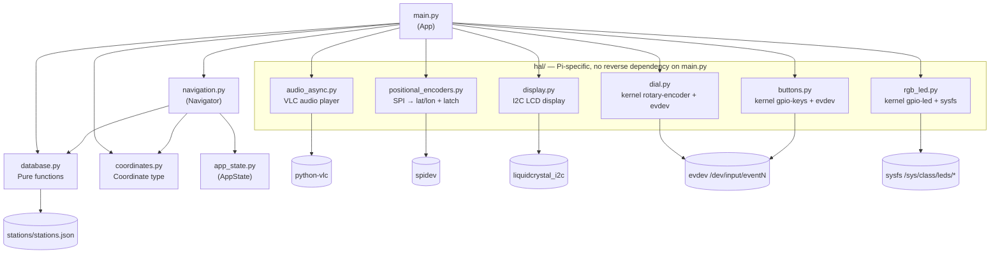

# RadioGlobe Architecture

This document is a guide for developers joining the project. It explains the physical hardware, how the software maps onto it, and what each module does. It also surfaces concrete improvement suggestions to make the code easier to maintain and extend.

This is not the setup guide — that's [README.md](README.md). For a brief asyncio design sketch, see [docs/DESIGN.md](docs/DESIGN.md). For how to submit changes, see [CONTRIBUTING.md](CONTRIBUTING.md).

---

## Table of Contents

1. [What RadioGlobe Is — Physical Context](#1-what-radioglobe-is--physical-context)
2. [Repository Layout](#2-repository-layout)
3. [Architecture Overview](#3-architecture-overview)
4. [Module Reference](#4-module-reference)
5. [Key Data Flows](#5-key-data-flows)
6. [State Management](#6-state-management)
7. [Concurrency Model](#7-concurrency-model)
8. [Configuration Reference](#8-configuration-reference)
9. [Testing](#9-testing)
10. [Contributing](#10-contributing)
11. [Suggested Improvements](#11-suggested-improvements)
12. [What's Already Good](#12-whats-already-good)

---

## 1. What RadioGlobe Is — Physical Context

Before the code makes sense, you need to picture the object.

A physical globe sits in a cradle. The cradle has a pivoting reticule — a crosshair arm — that the user positions over any point on the globe's surface. Two 10-bit absolute rotary encoders read the reticule's latitude and longitude as integer values from 0 to 1023. There is no "home position" — the encoders are absolute, not incremental, so they survive power cycles without recalibration (as long as the globe hasn't been physically moved).

Spinning the globe to point at London causes the software to look up London's radio stations and start playing one. A rotary dial on the base lets the user cycle through stations or cities. Four push-buttons handle volume, calibration, and power. A 20×4 character LCD and an RGB LED provide feedback.

The Raspberry Pi 4B runs Raspberry Pi OS Lite (Trixie). Audio plays through VLC via either the 3.5mm jack or Bluetooth.

### Hardware-to-Module Mapping

| Physical Component | Interface | GPIO / Address | Module |
|---|---|---|---|
| Globe reticule encoders (lat, lon) | SPI bus 0, devices 0 & 1 | — | `positional_encoders.py` |
| Station/city select dial | GPIO quadrature (kernel `rotary_encoder` driver + evdev) | Pins 18 (`pin_a`), 17 (`pin_b`) | `dial.py` |
| Jog button (mode toggle) | GPIO (kernel `gpio-keys` driver + evdev) | Pin 27 | `buttons.py` |
| Top button (volume up) | GPIO (kernel `gpio-keys` driver + evdev) | Pin 5 | `buttons.py` |
| Mid button (calibrate / shutdown) | GPIO (kernel `gpio-keys` driver + evdev) | Pin 6 | `buttons.py` |
| Bottom button (volume down) | GPIO (kernel `gpio-keys` driver + evdev) | Pin 12 | `buttons.py` |
| 20×4 character LCD | I2C | Bus 1, address 0x27 | `display.py` |
| RGB status LED | GPIO (kernel `gpio-led`/`leds-gpio` driver + sysfs) | R=22, G=23, B=24 | `rgb_led.py` |
| Audio output | VLC / PulseAudio | 3.5mm / Bluetooth | `audio_async.py` |

All GPIO-facing hardware (dial, buttons, LED) is driven entirely by kernel drivers, configured via `dtoverlay=...` lines in `/boot/firmware/config.txt` (installed by `install.sh`). Python never touches `RPi.GPIO` or any GPIO library — it reads `evdev` input devices and writes sysfs files.

### Button Operations

| Button | Short Press | Long Press |
|---|---|---|
| **Jog** (27) | Toggle station / city mode | — |
| **Top** (5) | Volume +10 | Set volume to 80 |
| **Mid** (6) | Calibrate encoders to 0,0 | Shutdown (`sudo poweroff`) |
| **Bottom** (12) | Volume −10 | Mute (volume to 0) |

---

## 2. Repository Layout

```
RadioGlobe/
├── src/
│   └── radioglobe/                   # Python application package (src layout)
│       ├── __init__.py               # Package init / __version__ shim
│       ├── main.py                   # App class: entry point, hardware orchestration, main loop
│       ├── app_state.py              # AppState dataclass: station/city selection state
│       ├── navigation.py             # Navigator: owns AppState + station/city data, no hardware deps
│       ├── radio_config.py           # App-behavior tuning constants (see §8)
│       ├── database.py               # Pure functions: station/city spatial index
│       ├── coordinates.py            # Coordinate value object (lat/lon → display string)
│       ├── hal/                      # Hardware Abstraction Layer: real hardware + Protocols + fakes + factory (see §4.14)
│       │   ├── protocols.py          # typing.Protocol per hardware role
│       │   ├── fake.py               # Fake* implementations for tests/off-Pi dev
│       │   ├── factory.py            # build_hardware(): constructs the real Pi-backed bundle
│       │   ├── audio_async.py        # AudioPlayer: wraps python-vlc directly
│       │   ├── display.py            # 20×4 I2C LCD driver
│       │   ├── dial.py               # evdev reader for kernel rotary-encoder device (station/city dial)
│       │   ├── positional_encoders.py # SPI encoders → lat/lon + latch mechanism
│       │   ├── buttons.py            # Multi-button manager with short/long press
│       │   └── rgb_led.py            # RGB LED flash controller
│       ├── cli.py                    # Console entrypoint for installed package
│       ├── _version.py               # Generated by setuptools_scm at build time
│       └── streaming/                # Lab: alternative streaming implementations, not used in production
│           ├── streaming.py          # subprocess + amixer volume
│           ├── streaming_cvlc.py     # cvlc subprocess wrapper (used in test scripts)
│           ├── python_vlc_streaming.py # python-vlc Streamer class
│           ├── async_streamer.py     # Async playlist resolver via aiohttp
│           └── files.py              # JSON loader helper for test scripts
│
├── tests/                            # Unit tests (run without hardware) + integration/ subfolder
│   ├── get_stations_by_city_test.py
│   ├── navigation_test.py
│   ├── buttons_test.py
│   ├── ...                           # See §9 Testing for the full list
│   └── integration/                  # Hardware / manual scripts — see tests/integration/README.md
│
├── stations/
│   └── stations.json                 # Radio station database (500+ cities)
│
├── services/
│   └── radioglobe.service            # systemd user service definition
│
├── scripts/                          # Deployment helpers for remote device installs
│   ├── deploy_remote.sh
│   └── force_deploy_remote.sh
│
├── docs/
│   └── DESIGN.md                     # Asyncio design notes
│
├── board/                            # PCB Gerber files and schematics
├── pyproject.toml                    # Package config and dev dependencies
├── requirements.txt                  # Runtime dependencies (includes git-sourced packages)
├── Makefile                          # Build, deploy, release targets
├── install.sh                        # Installation script for Raspberry Pi
└── update.sh                         # Device update script
```

**Key notes:**
- `streaming/` is not imported by the production code. The production audio module is `audio_async.py`.
- `tests/` contains unit tests (runnable on any machine) alongside `tests/integration/`, which holds the hardware integration scripts.

---

## 3. Architecture Overview

The application is a single-process asyncio program. One event loop runs on the main thread, and all hardware I/O runs as asyncio Tasks or pollable-fd registrations (`loop.add_reader`) — see §7.

**The central concept is the reticule position.** `PositionalEncoders.run_encoder()` polls SPI every 50ms. While unlatched, every successful reading sets an `asyncio.Event` (`encoders.updated`); the `_encoder_loop()` task wakes on that event, searches the spatial city index for any city near the current position, and if one is found, latches and starts playing its radio stream. Once latched, the event only fires again when the reticule drifts far enough to unlatch. The dial and buttons adjust the experience once a city is latched.

**Two operating modes** are toggled by the jog button:
- `station` mode — the dial cycles through stations within the current city
- `city` mode — the dial cycles through other nearby cities, reloading the first station for each

**The latch mechanism** prevents jitter. Once a city is found, the encoder's raw position is frozen until the user moves the reticule more than `STICKINESS` encoder steps away. Without this, the station would change continuously while the user browses with the dial.

### Module Dependency Graph


```mermaid
graph TD
    main["main.py\n(App)"]

    subgraph hal ["hal/ — Pi-specific, no reverse dependency on main.py"]
        positional["positional_encoders.py\nSPI → lat/lon + latch"]
        dial["dial.py\nkernel rotary-encoder + evdev"]
        buttons["buttons.py\nkernel gpio-keys + evdev"]
        display["display.py\nI2C LCD display"]
        led["rgb_led.py\nkernel gpio-led + sysfs"]
        audio["audio_async.py\nVLC audio player"]
    end

    main --> positional
    main --> dial
    main --> buttons
    main --> display
    main --> led
    main --> audio
    main --> nav["navigation.py\n(Navigator)"]
    main --> database["database.py\nPure functions"]
    main --> coordinates["coordinates.py\nCoordinate type"]

    nav --> appstate["app_state.py\n(AppState)"]
    nav --> database
    nav --> coordinates

    database --> stations[("stations/stations.json")]
    audio --> vlc[("python-vlc")]
    positional --> spidev[("spidev")]
    display --> i2c[("liquidcrystal_i2c")]
    dial --> input[("evdev /dev/input/eventN")]
    buttons --> input
    led --> sysfs[("sysfs /sys/class/leds/*")]
```

Everything under `hal/` (this diagram's shaded box) touches real hardware; everything outside it — `navigation.py`, `database.py`, `app_state.py`, `coordinates.py`, `radio_config.py`, `constants.py` — has zero hardware dependencies and can be imported and unit-tested on any platform. `main.py` is the only module that depends on both sides.

`App` also imports `get_stations_by_city` (`database.py`) directly — used
in `_encoder_loop()`/`_dial_loop()` to fetch a city's station list before
handing it to `self.nav.state.select_station()` — and `Coordinate`
(`coordinates.py`) for the shutdown-display fallback, so those two edges
aren't purely routed through `Navigator`.

The `streaming/` directory is intentionally omitted — none of its modules are imported by the main application.

---

## 4. Module Reference

### 4.1 `main.py` — App Controller

The `App` class is the central controller. `__init__` takes the hardware wrapper objects (§4.14) plus a `Navigator` (`self.nav` — §4.3), which owns all station/city data and navigation state. `App` itself handles hardware construction, the two event-driven loops, button dispatch, and `run()`.

`run()` calls `buttons.create_button_manager()` (§4.7) to wire its own callback methods to this board's fixed button layout, restores any saved state, and then starts and gathers the `_encoder_loop()` and `_dial_loop()` tasks — these two event-driven loops are the app's actual "main loop."

**State** lives on `self.nav.state` (an `AppState` — §4.2); `App` does not hold it directly. `save_state()`/`load_state()` are thin wrappers around `self.nav.save_state()`/`self.nav.load_state()` (§4.3) — `App`'s only job is passing `self.encoders.get_calibration()`'s dict through to `self.nav.save_state()`, and passing `load_state()`'s returned dict through to `self.encoders.restore_calibration()`. `App` doesn't know or care what's in that dict — `PositionalEncoders` owns its own calibration fields (`latitude`/`longitude`/`latitude_offset`/`longitude_offset`) and their dict representation entirely (§4.5); `Navigator` owns the JSON (de)serialisation and `AppState` reconstruction (§4.3). On boot, if a saved state is found, the latch is restored and the last station resumes playing immediately (warm-restart path).

**Key methods:**

| Method | Purpose |
|---|---|
| `run()` | Restore saved state, then start and gather `_encoder_loop()` and `_dial_loop()` |
| `_encoder_loop()` | Wake on `encoders.updated`, ask `self.nav.refresh_nearby_cities()` for nearby cities, latch via `self.nav.select_city()` and start playback when one is found |
| `_dial_loop()` | Wake on `dial.queue`, delegate to `self.nav.next_station()` or `self.nav.next_city_and_select_station()`, update playback |
| `save_state()` | Pass `self.encoders.get_calibration()` to `self.nav.save_state()` (§4.3) |
| `load_state()` | Pass `self.nav.load_state()`'s (§4.3) returned dict to `self.encoders.restore_calibration()` |
| `_update_volume(delta)` | Adjust volume by delta, briefly show level on display |
| `_update_volume_level(level)` | Set volume to an absolute level, briefly show on display |
| `_play_station()` | Show and play `self.nav.state.station` (`display.show_station()` + `audio_player.play()`), returning the URL played — the one place that unpacks the `(name, url)` station tuple |
| `_start_monitor_stream(url)` | Cancel any running monitor task, start a fresh `_monitor_stream` task, store the handle |
| `_monitor_stream(expected_url)` | Check VLC state every 3 s; on failure, flash LED red, drop the failed station (`self.nav.remove_failed_station()`), and play the next; exits once a station plays cleanly, all stations are exhausted, or the user switches away |
| `_handle_short_jog` / `_handle_long_jog` | Jog button handlers — short press calls `self.nav.switch_mode()` |
| `_handle_short_top` / `_handle_long_top` | Top button handlers |
| `_handle_short_mid` / `_handle_long_mid` | Mid button handlers |
| `_handle_short_bottom` / `_handle_long_bottom` | Bottom button handlers |
| `_on_jog_press` / `_on_sound_press` / `_on_mid_press` | Immediate press-down LED feedback |

All navigation logic — `next_station`, `next_city`, `switch_mode`, station-list bookkeeping, coordinate lookup, city latching/selection — lives entirely on `Navigator` (§4.3). `App` performs zero direct mutations of `nav.state` in either event loop; every mutation goes through a named `Navigator` method.

**Non-obvious details:**
- `self.nav.state.city` is passed to `display.show_station()`/`display.update()` as a raw string (e.g. `"London,GB"`). The display truncates it to 20 characters before centering.
- `save_state()` always writes `"latch": True`; on `load_state()` this causes the app to immediately resume playing the last station on next boot.
- If the warm-restart state is incomplete (city or station is `None` after `load_state()`), the app logs a warning, clears the latch, and falls back to calibrate mode rather than crashing.
- `load_state()` never reaches into `Navigator`'s internals directly — it just passes/returns plain dicts, so `App` doesn't need a hardware object to reconstruct state.
- `save_state()`/`load_state()` similarly never reach into `PositionalEncoders`' internal fields directly — `get_calibration()`/`restore_calibration()` (§4.5) let `App` pass an opaque dict through, the same pattern used for `Navigator`.

---

### 4.2 `app_state.py` — Selection State

A small dataclass holding the app's mutable station/city selection state, owned by `Navigator` (§4.3) rather than `App` directly. It has no hardware dependency: `main.py` transitively imports `evdev` at module level (via `buttons.py`, §4.14) and can't be imported off a Raspberry Pi at all without stubbing it, so anything meant to be unit-testable has to live somewhere that doesn't transitively pull that in.

| Field | Type | Meaning |
|---|---|---|
| `stations` | `list[(name, url)]` | Stations for the current city |
| `station` | `tuple \| None` | Currently playing station |
| `station_idx` | `int` | Index of `station` within `stations` |
| `cities` | `list[str]` | Cities found in the current search zone |
| `city` | `str \| None` | Currently selected city (e.g. `"London,GB"`) |
| `city_idx` | `int` | Index of `city` within `cities` |
| `mode` | `str` | `"station"` or `"city"` |

**Methods:**
- `is_complete() -> bool` — whether both `city` and `station` are set. Used throughout `main.py` and `navigation.py` as the guard for "is there anything to display/play/navigate."
- `select_station(stations) -> bool` — sets `self.stations`, resets `self.station_idx = 0`, and if the list is non-empty, `self.station = stations[0]`; returns whether a station was selected.

`station_idx` and `city_idx` are independent fields, each mutated only by the method that owns that concern (`select_station()` for the former, `Navigator.next_city()`/`switch_mode()` for the latter), so neither needs to be recomputed when the mode changes.

Unit-tested directly (`tests/app_state_test.py`) — pure data, no mocking needed.

---

### 4.3 `navigation.py` — Navigator

`Navigator` owns everything about *what city/station is currently selected and how to change it*. Like `app_state.py`, it has no hardware dependency, so it's constructible and unit-testable off a Pi the same way `database.py` always was (`tests/navigation_test.py` builds one against an in-memory fixture station dict, no mocking).

**Owns:**
- `self.state: AppState` (§4.2)
- `self.stations_info`, `self.cities_info`, `self.look_around_offsets` — built in `__init__` from `load_stations()`/`build_cities_index()`/`build_look_around_offsets()` (§4.4), defaulting to `STATIONS_JSON`/`FUZZINESS` but overridable via constructor args — this is how the test suite avoids loading the real `stations.json`

**Methods:**

| Method | Purpose |
|---|---|
| `current_coords` (property) | `Coordinate` for `self.state.city`, or `None` if no city is selected |
| `find_cities_near(origin)` | Thin wrapper around `database.find_cities_near()` using `self.look_around_offsets`/`self.cities_info` |
| `refresh_nearby_cities(coords)` | Recompute `self.state.cities` via `find_cities_near(coords)` and return it |
| `select_city()` | Latch onto the closest nearby city (`self.state.cities[0]`) and select its first station; returns `False` (state untouched) if there are no nearby cities or the closest one has no stations. Used by `App._encoder_loop()`'s latch path |
| `next_city_and_select_station(direction)` | Cycle to the next/previous city (`next_city()`) and select its first station; returns `False` (previous station keeps playing) if the new city has no stations. Used by `App._dial_loop()`'s `MODE_CITY` branch |
| `next_station(direction)` | Cycle `station_idx` within `self.state.stations` |
| `next_city(direction)` | Cycle `city_idx` within `self.state.cities` |
| `switch_mode()` | Toggle `self.state.mode` |
| `remove_failed_station()` | Drop the current station from the session list and advance to the next by `station_idx`; called from `App._monitor_stream()` on playback failure |
| `save_state(encoder_offsets, cache)` | Serialise `self.state` + `encoder_offsets` (a plain dict — keys `lat`/`lon`/`lat_offset`/`lon_offset` — supplied by the caller, since `Navigator` has no hardware access of its own) to `cache` as JSON |
| `load_state(cache)` | Restore `self.state` from `cache`, re-querying/validating the saved city and station against the live `stations_info`; returns the saved encoder offsets as a plain dict (or `{}` if no cache file exists) for the caller to apply |

**What deliberately stays on `App` instead:** hardware construction, the two event loops (as timing/LED/logging orchestration around `Navigator` calls), and button dispatch/`run()`. `App.__init__` takes its hardware objects as constructor parameters typed against Protocols (§4.14); `ButtonManager` is not constructor-injected, since it needs app-bound callback methods that don't exist until `App` itself is constructed (§4.14).

`save_state()`/`load_state()` never touch `self.encoders` directly — `Navigator.save_state()`/`load_state()` take and return plain encoder-offset dicts (see Methods table above), so `App`'s versions are a few lines gathering/applying `self.encoders`' values around a call into `self.nav`. The on-disk cache format (`~/cache/radioglobe.json`) is stable across reads and writes made by either object.

---

### 4.4 `database.py` — Station Data

Pure functions with no side effects and no hardware dependencies. The most testable module in the project.

**Functions:**

| Function | Returns | Notes |
|---|---|---|
| `load_stations(path)` | `dict` keyed by `"City,CC"` | Returns empty dict on FileNotFoundError |
| `build_cities_index(stations_data)` | `dict[(lat_idx, lon_idx) → list[city_name]]` | Converts lat/lon degrees to 0–1023 grid indices; multiple cities per cell are supported |
| `build_look_around_offsets(fuzziness)` | `list` of `(dx, dy)` tuples | Pre-computes the search-zone offset pattern once, at startup (`Navigator.__init__` — §4.3) |
| `look_around(origin, offsets)` | `list` of `(lat, lon)` tuples | Applies the pre-computed offsets to an origin point — cheap enough to call on every encoder event |
| `find_cities_near(origin, offsets, cities_index)` | `list` of city strings, closest-first | The production city search; wrapped by `Navigator.find_cities_near()` (§4.3), called from `_encoder_loop()` in `main.py` |
| `get_stations_by_city(stations, city)` | `list` of `(name, url)` tuples | The canonical station list format |
| `get_coords_by_city(stations, city)` | `Coordinate` | Raises `KeyError` if the city isn't in the data — backs `Navigator.current_coords` and the stale-city check in `Navigator.load_state()` (§4.3) |
| `match_saved_station(saved_name, stations)` | `(station, station_idx)` tuple | Finds a saved station by name in a refreshed station list, falling back to index 0 if not found; used by `Navigator.load_state()`'s warm-restart path (§4.3) |
| `get_found_cities(search_area, city_map)` | `list` of city strings | Used only by integration test scripts; superseded in production by `find_cities_near` |

**Coordinate formula:** `index = round((degrees + 180) * 1024 / 360)`. This maps −180°→0 and +180°→1024.

**`build_look_around_offsets()` detail:** `fuzziness=1` returns just the origin offset; `fuzziness=2` returns 9 offsets (3×3 area); `fuzziness=3` returns 25 offsets (5×5 area) — the app's default (`FUZZINESS = 3`, see [§8](#8-configuration-reference)). The pattern is built innermost-first, so `find_cities_near()` returns matches closest-first. The search starts bottom-left and scans horizontally — this matches ergonomics (70% of people are right-eye dominant and hold the globe below eye level).

`get_stations_info` at the bottom of the file is not used by the main application — only by integration test scripts.

---

### 4.5 `hal/positional_encoders.py` — Globe Position

Reads two SPI absolute rotary encoders and maintains the current lat/lon position.

`_ENCODER_RESOLUTION` (1024) is owned by `database.py` — not this module — and imported here, since `database.py`'s grid-coordinate math needs the same value and is deliberately hardware-free (§4.4). Owning it in the pure module rather than here avoids giving `database.py` a dependency on a hardware-touching module.

**Key behaviour:**
- Each encoder is read via SPI bus 0, device 0 (latitude) and device 1 (longitude), at 1,000,000 Hz, SPI mode 1 — the datasheet maximum for the Bourns EMS22A50-D28-LT6.
- Raw readings are 16 bits; the top 10 bits (after shifting right by 6) give the 0–1023 position.
- `check_parity()` validates each reading. If parity fails, the entire read returns `None` and is discarded.
- Latitude is inverted: `readings[0] = _ENCODER_RESOLUTION - readings[0]`. This corrects for encoder mounting orientation.
- `run_encoder()` is an event-driven task, not a target the app polls: while unlatched, it sets `self.updated` (an `asyncio.Event`) on every successful read; `main.py`'s `_encoder_loop()` awaits this event instead of polling on its own. Once latched, the event only fires again when the position drifts past `latch_stickiness`.

**The latch mechanism:**
- `latch(lat, lon, stickiness)` stores the latched position and sets `latch_stickiness` to the threshold value.
- While latched, `run_encoder()` still reads SPI but only updates `self.latitude`/`self.longitude` if the new reading differs by more than `latch_stickiness` steps. A deviation must be seen on `UNLATCH_CONFIRM_THRESHOLD` (2) consecutive readings before it actually unlatches, filtering single-sample sensor noise (the EMS22A50 datasheet specifies ~0.12° RMS output transition noise) from real movement. Once confirmed, `latch_stickiness` is set to `None` (unlatched) and reading resumes normally.
- `is_latched()` returns `True` if `latch_stickiness is not None`.

**Calibration:** `zero()` sets offsets so the current physical position maps to (512, 512), which corresponds to 0°N, 0°E (the equator / prime meridian intersection). `get_readings()` always returns the offset-adjusted value modulo `_ENCODER_RESOLUTION`. `reset_latch()` clears `latch_stickiness` so `_encoder_loop()` can re-detect cities after zeroing — `zero()` alone does not clear the latch.

**Persistence:** `get_calibration()` returns `{"lat", "lon", "lat_offset", "lon_offset"}` as a plain dict; `restore_calibration(state)` applies one back and also sets `latch_stickiness = True`, since a restored position always represents a previously-latched city. These let `App.save_state()`/`load_state()` (§4.1) work without knowing this class's internal field names — `PositionalEncoders` is the only thing that reads or writes its own `latitude`/`longitude`/`latitude_offset`/`longitude_offset`/`latch_stickiness`.

---

### 4.6 `hal/dial.py` — Station / City Selector

Reads a quadrature rotary encoder wired to GPIO pins 18 and 17 — these are the encoder's two switch/channel outputs (A/B), not a clock/direction pair. Decoding happens entirely in the **kernel**, not in Python: `install.sh` adds `dtoverlay=rotary-encoder,pin_a=18,pin_b=17,relative_axis=1` to `/boot/firmware/config.txt`, which binds the stock `drivers/input/misc/rotary_encoder.c` driver to those two pins and does the gray-code decode into `EV_REL`/`REL_X` events.

- `start()` calls `Dial._find_rotary_device()`, which locates the resulting `/dev/input/eventN` device via `evdev.list_devices()`, matching by capability (`EV_REL`/`REL_X` present, `EV_KEY` absent) rather than a hardcoded device name or event-number, so it survives reboots and eventN renumbering — `__init__` itself never touches evdev.
- `start()` then registers the device's file descriptor directly on the asyncio event loop with `loop.add_reader(fd, callback)` — no background task, no thread pool.
- `_on_readable()` pushes `_POLARITY * sign(event.value)` onto `self.queue` (an `asyncio.Queue[int]`, via `put_nowait`) directly for each `REL_X` event — no accumulation or timer. A single `_POLARITY` constant corrects for physical wiring.
- `stop()` calls `loop.remove_reader(fd)`, which is synchronous and immediate.
- `main.py`'s `_dial_loop()` consumes `await self.dial.queue.get()` — the kernel-driver decode is entirely internal to `dial.py`.

---

### 4.7 `hal/buttons.py` — Button Manager

Manages four buttons with short and long press detection, each read via the kernel's `gpio-keys` driver + evdev, the same kernel-driver approach `dial.py` (§4.6) uses for the dial's rotation.

**Button definition tuple:**
```python
ButtonDefinition(name, pin, short_cb, long_cb, press_cb, keycode)
```
- `press_cb` fires immediately on press-down (used for instant LED feedback)
- `short_cb` fires on release if held < 1.0 second
- `long_cb` fires on release if held ≥ 1.0 second
- `keycode` identifies which evdev device belongs to this button (see below)

The name+pin+keycode triple is fixed by this project's custom board (Jog/Top/Mid/Bottom are wired to specific header pins, not an app-level choice), so `buttons.py` owns it completely: `JOG_BUTTON`, `TOP_BUTTON`, `MID_BUTTON`, `BOTTOM_BUTTON` are module-level `ButtonDefinition` constants with `name`/`pin`/`keycode` set and every callback field left at its `None` default. The wiring itself — attaching a caller's callbacks to those four fixed slots and constructing the manager — is also fixed by the board, so it lives here too, as `create_button_manager()`:
```python
class ButtonCallbacks(NamedTuple):        # ButtonDefinition minus name/pin/keycode
    short_cb: Optional[Callable] = None
    long_cb: Optional[Callable] = None
    press_cb: Optional[Callable] = None

def create_button_manager(*, jog=ButtonCallbacks(), top=ButtonCallbacks(), ...) -> ButtonManager:
    button_definitions = [
        JOG_BUTTON._replace(**jog._asdict()),
        TOP_BUTTON._replace(**top._asdict()),
        ...
    ]
    return ButtonManager(button_definitions)
```
`main.py`'s `run()` (§4.1) calls this once with its own callback methods — it never imports `JOG_BUTTON`/`TOP_BUTTON`/`MID_BUTTON`/`BOTTOM_BUTTON` or `ButtonManager` itself, only `create_button_manager`. The callback *bodies* (`_handle_short_jog` etc.) stay on `App`, unchanged — they orchestrate `self.nav`/`self.display`/`self.led`/`self.encoders`/`self.audio_player`, which `buttons.py` deliberately knows nothing about (§4.14's HAL boundary). Like `hal/factory.py`'s `build_hardware()`, `create_button_manager()` only constructs — `run()` still calls `await button_manager.start()` and creates the `handle_events()` task itself. Neither function takes a `loop` parameter — `Button.start()` calls `asyncio.get_running_loop()` internally instead, matching `dial.py`/`positional_encoders.py`'s pattern.

The underlying `_PIN_BTN_*` constants (§8) are documentation only — the kernel driver claims these pins directly via `install.sh`'s `dtoverlay=gpio-key,...` lines, not via anything in this module. Device discovery instead keys off `_KEYCODE_BTN_*` (§8): each overlay instance is given a distinct Linux "generic button" keycode (`evdev.ecodes.BTN_0..BTN_3`), and `Button._find_button_device()` scans `evdev.list_devices()` for the one whose `EV_KEY` capability includes that keycode (and has no `EV_REL`, ruling out the dial). This is necessary, not just tidy: with 4 buttons' `gpio-key` overlay instances active simultaneously, the kernel names every one of them `button@<hex-gpio>` regardless of the overlay's `label=` parameter — there's no reliable name-based way to tell them apart, so the keycode each device is configured to report is the only distinguishing signal. `install.sh`'s overlay lines must use the same keycode values.

Device discovery is deferred to `Button.start()`/`ButtonManager.start()` rather than done in `__init__` — this is what lets `tests/buttons_test.py` keep constructing `ButtonManager`/`ButtonDefinition` with synthetic data and testing `handle_events()`'s dispatch logic in isolation, since those tests never call `.start()` and so never touch real evdev devices.

`Button._on_readable()` is registered on the asyncio loop via `loop.add_reader(fd, callback)` once its device is found — no thread, no polling task, same pattern `dial.py` uses. On a key-down event it fires `press_cb` immediately; on key-up it computes the held duration and `put_nowait`s `(name, "short"/"long")` onto the manager's shared `event_queue`. The kernel guarantees a clean release event, so there's no busy-wait release-polling state machine and no way for a press to get "stuck."

`handle_events()` wraps each handler call in try/except, logging failures via `logging.exception()`. Without this, an unhandled exception from any one button's `short_cb`/`long_cb` would kill this loop outright — since it's the single consumer for every button's queued events, that silently stops short/long dispatch for *all four buttons*, not just the one whose handler failed. Press-down feedback (`press_cb`) keeps working regardless, since it fires via its own `asyncio.create_task()` rather than going through this shared loop.

---

### 4.8 `hal/display.py` — LCD Display

Drives a 20×4 I2C character LCD at address 0x27 on bus 1, using the `liquidcrystal_i2c` library.

- Internally maintains a 4-line text buffer and an `asyncio.Event` (`changed`). When `update()` or `message()` is called, the buffer is updated and the event is set.
- `_display_loop()` is an asyncio Task that waits for the event, writes all 4 lines to the LCD, and sleeps 100ms. This coalesces rapid updates — important because I2C is slow.
- All 4 buffer lines (coords, location, volume bar, station) are truncated to `_DISPLAY_COLUMNS` characters before `center()` is applied, so overlong city or station names never overflow the hardware line buffer.
- `show_station(coords, city, station_name)` and `show_status(status, coords=None)` wrap `update()`'s 5-argument shape for the two call patterns `App` actually uses. The one place `App` still calls `update()` directly is the volume overlay in `_show_volume_briefly()`, which needs the `volume` argument `show_station()` hardcodes to 0.

**Display layout when playing:**
```
Line 0: 51.50N, 0.13W        ← Coordinate.__str__()
Line 1: London,GB             ← City name
Line 2: --------              ← Volume bar (ASCII dashes, scales 0–100)
Line 3: BBC Radio 2           ← Station name
```

---

### 4.9 `hal/audio_async.py` — Audio Player

Wraps `python-vlc` directly. Does not import from `streaming/`.

```python
class AudioPlayer:
    def __init__(self):
        self.instance = None
        self.player = None
        self.current_url = None

    def start(self):
        self.instance = vlc.Instance(
            "--input-repeat=-1",
            "--network-caching=2000",
        )
        self.player = self.instance.media_player_new()
```

The VLC instance/player are constructed in `start()`, not `__init__` — constructing an `AudioPlayer` never touches VLC (§4.14's `HardwareComponent` contract).

- `play(url)` stops any current playback and starts the new URL immediately. VLC handles playlist URLs (`.m3u`, `.pls`) internally. It records `current_url` so `_monitor_stream` can detect when the user has moved to a new station. `AudioPlayer` only ever deals in URL strings — it has no concept of a "city" or "station"; callers extract the URL from `self.nav.state.station[1]` before calling.
- `--input-repeat=-1` means VLC retries the stream automatically if the connection drops.
- `--network-caching=2000` adds a 2 s jitter buffer to absorb network hiccups without triggering error state.
- Volume is managed via VLC's `audio_get_volume` / `audio_set_volume`, range 0–100.
- `is_error()` returns `True` if VLC is in `State.Error` **or** `State.Ended`. Both indicate failure for a live stream: `Error` for codec/protocol failures, `Ended` for HTTP 404 responses.
- Dead-stream detection is handled by `App._monitor_stream(expected_url)` in `main.py`. It checks `is_error()` every 3 s. On failure it flashes the LED red, removes the failed station from the session list (`self.nav.remove_failed_station()` — `Navigator`, §4.3), and immediately plays and displays the next station — looping until one plays cleanly, all stations for the city are exhausted, or the user selects something else, at which point the loop exits silently.

---

### 4.10 `hal/rgb_led.py` — Status LED

Three LED channels (R=22, G=23, B=24), each driven via the kernel's `gpio-led`/`leds-gpio` driver + sysfs — the same kernel-driver approach `dial.py` (§4.6) and `buttons.py` (§4.7) use for their GPIO inputs.

Each channel is controlled by writing `"1"`/`"0"` to `/sys/class/leds/<label>/brightness`, where `<label>` comes from `install.sh`'s `dtoverlay=gpio-led,gpio=<pin>,label=<label>` line. `RGBLed.start()` resolves each label to a path via `_resolve(label)` and does a one-time test write, converting a `PermissionError` into a `RuntimeError` that names the udev rule to check (see the permissions note below) — `__init__` only stores the three labels, deferring the actual sysfs access to `start()` like every other HAL role.

`max_brightness` is `1` for these LEDs — binary on/off only, no dimming.

`RGBLed.flash(colour, duration)` is an async method, always spawned with `asyncio.create_task()` rather than awaited. It:
1. Checks its own `self._running` Event to prevent overlapping flashes (a no-op if a flash is already in progress)
2. Sets the event, turns the LED on
3. Sleeps for `duration` seconds
4. Turns the LED off and clears the event

`RGBLed.stop()` calls `self.off()` — nothing further to release, since Python never claims these pins; the kernel driver does, exactly like `dial.py`/`buttons.py`.

**Permissions:** `/sys/class/leds/*/brightness` is `root:root` mode `644` by default. `install.sh` installs a udev rule (`/etc/udev/rules.d/99-radioglobe-leds.rules`) granting the `radioglobe` user's existing `gpio` group write access, and reloads/retriggers udev so a re-run fixes permissions on LEDs that already exist from a prior boot.

`COLOUR_RED`/`COLOUR_GREEN`/`COLOUR_BLUE`/`COLOUR_WHITE`/`COLOUR_OFF` are public constants owned here, and `RGBLed.COLOURS` (the colour-name → RGB-tuple mapping) is built from them. `main.py` and the integration test scripts (`led_test.py`, `main_test.py`, `streaming_cvlc_test.py`) import the colour names from `radioglobe.hal.rgb_led`.

**Colour conventions used in `main.py`:**
- Green: city found/latched, button press feedback
- Blue: dial turned, volume button press
- Red: stream playback failure

---

### 4.11 `coordinates.py` — Coordinate Type

A simple value object. `__str__` produces the display format used on the LCD:

```python
>>> str(Coordinate(51.5074, -0.1278))
'51.51N, 0.13W'
```

Equality comparison rounds to 2 decimal places (`ROUNDING = 2`). Used consistently throughout `main.py` and `display.py` — all `display.update()` call sites pass a `Coordinate` object.

---

### 4.12 `radio_config.py` — Configuration

Defines app-behavior tuning constants shared across modules (volume levels, display/LED durations, search fuzziness/stickiness, file paths, log level). Constants tied to a single piece of physical hardware (GPIO pins, I2C address, encoder resolution) live as private (leading-underscore) constants in the module that owns that hardware instead — see [§8 Configuration Reference](#8-configuration-reference) for the full list and rationale.

No side-effects on import — it is a constants-only module. Logging is configured in `main.py`'s `__main__` block.

---

### 4.13 `streaming/` — Alternative Streaming Implementations

This directory contains streaming approaches that are not imported by the production code (`audio_async.py`).

| File | Approach | Status |
|---|---|---|
| `streaming.py` | subprocess + amixer volume | Not used |
| `streaming_cvlc.py` | `cvlc` CLI subprocess | Used in integration test scripts |
| `python_vlc_streaming.py` | python-vlc with explicit playlist detection | Not used |
| `async_streamer.py` | Async playlist URL resolver using aiohttp | Not used |
| `files.py` | JSON station loader helper | Used by test scripts |

If you need to understand the audio subsystem, read `audio_async.py`.

---

### 4.14 `hal/` — Hardware Abstraction Layer

Everything that touches real hardware lives here, keeping the package-level split simple: `hal/` = Pi-specific, everything else under `radioglobe/` = pure app logic with no hardware dependencies. `dial.py`, `positional_encoders.py`, `buttons.py`, `rgb_led.py`, `display.py`, and `audio_async.py` (§4.5-§4.10) moved into `hal/` from the package's top level for this reason — none of them needed to change, since `Protocol` uses structural typing and none had relative imports besides `positional_encoders.py` (`from .database import ...` → `from ..database import ...`) and `display.py` (`from .coordinates import ...` → `from ..coordinates import ...`) picking up one extra `.` for the new nesting depth. Alongside them, three files make up the abstraction proper:

- **`protocols.py`** — one `typing.Protocol` per hardware role (`DialProtocol`, `PositionalEncodersProtocol`, `ButtonManagerProtocol`, `RGBLedProtocol`, `DisplayProtocol`, `AudioPlayerProtocol`), matching each real class's public method signatures exactly. `Protocol` uses structural typing, so the six real classes already satisfy these interfaces by shape alone — no inheritance required. A shared `HardwareComponent` base declares `def start(self) -> None` and `async def stop(self) -> None`: every concrete class defers real hardware I/O (device discovery, sysfs writes, opening an I2C bus, constructing a VLC instance) from `__init__` to `start()`, so constructing any of the six is always hardware-free — the same deferred-construction pattern `buttons.py`'s `Button` originated (§4.7).
- **`fake.py`** — `FakeDial`, `FakePositionalEncoders`, `FakeButtonManager`, `FakeRGBLed`, `FakeDisplay`, `FakeAudioPlayer`. Each satisfies its Protocol and exposes simple test hooks (`push_turn()`, `set_position()`, `inject_event()`, `set_error()`, `.calls`/`.played`/`.buffer` recordings) that let a test drive `App`'s real event loops end-to-end with no real I/O. These fakes intentionally do **not** re-implement the real modules' internals (SPI parity checks, evdev capability matching, press/hold timing) — that stays covered separately, e.g. `tests/buttons_test.py`'s stub-and-test-the-real-class approach.
- **`factory.py`** — `build_hardware()` constructs and returns the real, Pi-backed `(dial, audio_player, encoders, display, led)` tuple. The concrete hardware modules are imported inside its function body, not at module scope, so importing `radioglobe.hal` never pulls in `evdev`/`spidev`/`liquidcrystal_i2c`/`vlc` — only calling `build_hardware()` does. This still holds even though the concrete modules are now siblings inside `hal/`: Python never auto-imports a package's submodules just because the package itself was imported, and `hal/__init__.py` only imports `.protocols` and `.factory`, neither of which imports `.dial`/`.buttons`/etc. at their own module scope.

`App.__init__` (§4.1) takes these 5 hardware objects as required constructor parameters (typed against the Protocols above) instead of constructing them itself; `nav` stays optional since `Navigator` has no hardware dependency. `cli.py` and `main.py`'s `__main__` block are the only two real call sites, both `App(*build_hardware()).run()`.

**`ButtonManager` is not constructor-injected.** It's built inside `run()` (`main.py`) because it needs app-bound callback methods (`self._handle_short_jog`, etc., via `ButtonDefinition._replace(...)`) that don't exist until `App` itself is constructed. `FakeButtonManager` exists in `hal/fake.py` for tests that want to drive `App` without any hardware involvement at all, but `tests/buttons_test.py`'s real-class-plus-stub approach remains the way to test `ButtonManager`/`Button` themselves.

`create_button_manager`/`ButtonCallbacks` are only ever used inside `run()` (never as a type annotation or at class-definition time), so `main.py` imports them from `radioglobe.hal.buttons` inside `run()`'s body rather than at module scope — mirroring `build_hardware()`'s own deferred-import pattern. `hal/buttons.py` imports `evdev` at module scope, so this means `import radioglobe.main` (and therefore `radioglobe.cli`) does **not** require `evdev` to be importable; only actually calling `run()` does. `tests/main_test.py` needs no `evdev` stub as a result — none of the unit tests call `App.run()`, they drive `_encoder_loop()`/`_dial_loop()`/etc. directly.

Pi-specific packages (`evdev`, `smbus`, `spidev`, `liquidcrystal-i2c`, `python-vlc`) live in `pyproject.toml`'s optional `pi` extra (`pip install .[pi]`), not the base `dependencies` — see §8.

---

## 5. Key Data Flows

### Flow A: Globe Spun to a New City

1. `PositionalEncoders.run_encoder()` polls SPI every 50ms. While unlatched, each successful read sets `encoders.updated` (an `asyncio.Event`).
2. `_encoder_loop()` wakes on that event, clears it, and calls `encoders.get_readings()` — returns the offset-adjusted `(lat, lon)` tuple.
3. `self.nav.refresh_nearby_cities(coords)` (`Navigator`, §4.3) applies the pre-computed offset pattern — 25 points (5×5 area) for the default `FUZZINESS = 3` — stores and returns matching cities, closest-first.
4. If cities are found and the encoders are not already latched:
   - `encoders.latch(*coords, stickiness=STICKINESS)` freezes the position.
   - The LED flashes green (`self.led.flash(...)`, §4.10).
   - `self.nav.select_city()` (`Navigator`, §4.3) latches `state.cities[0]` as the current city, resets `city_idx` to 0, and selects its first station via `get_stations_by_city()` + `AppState.select_station()`; returns `False` (and the latch is undone) if the closest city has no stations.
5. `audio_player.play(station[1])` passes the URL to VLC.
6. `display.show_station(coords, city, station_name)` refreshes the LCD (§4.8).
7. `_start_monitor_stream(station_url)` cancels any previous monitor and starts a new one, which checks playback every 3 s and switches to the next station on failure.

### Flow B: User Turns the Dial

1. The kernel's `rotary_encoder` driver decodes GPIO 17/18 transitions and emits an `EV_REL`/`REL_X` evdev event; `Dial`'s `loop.add_reader` callback reads it and pushes the direction onto `dial.queue`.
2. `_dial_loop()` wakes with `await self.dial.queue.get()` — no polling.
3. The LED flashes blue.
4. If `mode == "station"`: `self.nav.next_station(direction)` increments/decrements `station_idx` within `self.nav.state.stations` (wraps around).
5. If `mode == "city"`: `self.nav.next_city_and_select_station(direction)` (`Navigator`, §4.3) increments/decrements `city_idx` within `self.nav.state.cities` and selects the new city's first station in one call, returning `False` (previous station keeps playing) if the new city has no stations.
6. `display.show_station()` and `audio_player.play()` update immediately.

---

## 6. State Management

Application state lives on `self.nav.state` — an `AppState` (§4.2) owned by `Navigator` (§4.3), not held directly by `App`. See §4.2 for the field table.

Encoder state (lat/lon, offsets, latch) is owned by `PositionalEncoders` on `self.encoders` — separate from `AppState`.

On shutdown (long press of mid button), `App.save_state()` gets a plain dict from `self.encoders.get_calibration()` (§4.5) and hands it to `self.nav.save_state()` (§4.3), which calls `dataclasses.asdict(self.state)` and appends the encoder offsets and latch flag, writing the result to `~/cache/radioglobe.json`. On the next boot, `App.load_state()` calls `self.nav.load_state()`, which reconstructs an `AppState(...)` from the JSON, then immediately re-queries `get_stations_by_city()` from the live database and calls `match_saved_station()` (`database.py`, §4.4) to match the saved station by name (falling back to index 0 if not found) — this means a `stations.json` update between boots never causes a wrong URL or stale index. `Navigator.load_state()` returns the saved encoder offsets as a plain dict, which `App.load_state()` passes straight to `self.encoders.restore_calibration()` (§4.5) without inspecting it — `App` never touches an encoder's internal fields directly.

---

## 7. Concurrency Model

The entire application runs on a single asyncio event loop, made up of several independent, event-driven tasks rather than one polling "main loop." Understanding this is essential before modifying any hardware module.

**Tasks running concurrently (started from `run()` and component `start()` calls):**
```python
# dial.start() and each button's start() are NOT tasks — they're
# loop.add_reader(fd, callback) registrations. The kernel driver
# (rotary_encoder for the dial, gpio-keys for each button) does the
# decode; the event loop invokes the callback directly whenever the
# evdev fd is readable, pushing to dial.queue / button_manager.event_queue.
asyncio.create_task(encoders.run_encoder())          # polls SPI every 50ms, sets encoders.updated
asyncio.create_task(display._display_loop())         # writes LCD on `changed` event
asyncio.create_task(button_manager.handle_events())  # dispatches queued button events
asyncio.create_task(self._encoder_loop())            # wakes on encoders.updated — latches cities
asyncio.create_task(self._dial_loop())               # wakes on dial.queue — navigates stations/cities
```
`run()` only awaits the last two (`await asyncio.gather(encoder_task, dial_task)`); the others run in the background for the app's lifetime.

**Every hardware source is event-driven** via `loop.add_reader(fd, callback)` — `positional_encoders.py`'s SPI poll is the only fixed-interval task in the app, since SPI has no equivalent kernel-driven evdev path. If any future hardware module ever needs a genuinely blocking call, wrap it with `asyncio.to_thread()` rather than calling `asyncio.create_task()` directly from a non-asyncio thread; prefer `loop.add_reader(fd, callback)` whenever the hardware exposes a pollable file descriptor instead (evdev devices, sockets, pipes), as every hardware module here does.

**LED tasks** are always `create_task`'d rather than awaited — they are fire-and-forget. `RGBLed`'s own internal `self._running` Event prevents concurrent flashes (§4.10).

**What to be careful about:** Do not put any blocking call (file I/O, `time.sleep()`, synchronous network calls) directly in any of these loop bodies. Every blocking call holds up all other hardware tasks.

**HAL note:** `hal/protocols.py` (§4.14) describes each role's real notification shape as-is — `DialProtocol.queue`, `PositionalEncodersProtocol.updated`, `ButtonManagerProtocol.event_queue`, `DisplayProtocol.changed` — rather than forcing a single uniform callback/event interface. A HAL that hid the queue/event/polled-task differences above behind one generic shape would regress the bridging patterns this section documents.

---

## 8. Configuration Reference

`radio_config.py` holds only app-behavior tuning constants — values about UX/timing/search behaviour, not tied to a specific piece of physical hardware. Constants describing a single component's wiring or protocol (a GPIO pin, an I2C address, an SPI timing value, an encoder's bit resolution) live as private (leading-underscore) constants in the module that owns that hardware, and are not re-exported. Where another module genuinely needs the value, it imports it directly from the owning module by name (e.g. `positional_encoders.py` imports `_ENCODER_RESOLUTION` from `database.py`, §4.5). This mirrors `display.py`'s `_DISPLAY_COLUMNS`/`_DISPLAY_ROWS` pattern. `buttons.py` goes a step further: its `_PIN_BTN_*` pin constants have zero consumers outside the module — `main.py` and the integration test scripts consume the higher-level `JOG_BUTTON`/`TOP_BUTTON`/`MID_BUTTON`/`BOTTOM_BUTTON` constants instead (§4.7), never a raw pin number.

**The test for which side of this line a constant falls on:** would its value need to change if the physical part were swapped for a different one doing the same job? If yes — a different LED module might support a different set of colours, a different encoder chip might have a different bit resolution, a different board revision might wire a button to a different pin — it's hardware-intrinsic and belongs in the module that owns that part. If no — the value is a UX/behavior choice `main.py` makes when it reacts to a hardware event, and would stay exactly the same regardless of which physical part triggered it — it belongs in `radio_config.py`, *even if only one hardware-triggered code path uses it today*. "Only `buttons.py`'s button presses ever call this" is not the same question as "is this a property of the button hardware." The colour constants below (`COLOUR_RED` etc., owned by `rgb_led.py`) are on the hardware-intrinsic side of this line: a different LED module genuinely could support a different colour set, and `RGBLed.COLOURS` is built from them, so the hardware module needs the vocabulary internally regardless of who else imports it.

### `radio_config.py` — app-behavior tuning (shared)

| Parameter | Value | Where used |
|---|---|---|
| `STATIONS_JSON` | `"stations/stations.json"` | `navigation.py` — station data path |
| `FUZZINESS` | 3 | `navigation.py` — `Navigator.__init__` default, builds the 25-point (5×5) search zone; also logged (but not otherwise used) in `main.py`'s `_encoder_loop()` debug output |
| `STICKINESS` | 2 | `main.py` — unlatch threshold in encoder steps |
| `VOLUME_STEP` / `DEFAULT_VOLUME` / `VOLUME_ON_LEVEL` / `VOLUME_OFF_LEVEL` | 10 / 50 / 80 / 0 | `main.py` — volume handling |
| `BRIEF_DISPLAY_DURATION` / `MESSAGE_DISPLAY_DURATION` | 0.5 / 2 | `main.py` — display hold durations |
| `STREAM_CHECK_INTERVAL` | 3 | `main.py` — stream health check grace period |
| `LED_FLASH_SHORT` / `LED_FLASH_LONG` / `LED_FLASH_DIAL` | 0.2 / 0.5 / 0.1 | `main.py` — LED feedback durations passed to `RGBLed.flash()` |
| `STATE_CACHE_PATH` | `"~/cache/radioglobe.json"` | `main.py` — default arg for `App.save_state()`, passed explicitly to `self.nav.load_state()`; also `navigation.py` — default arg for `Navigator.save_state()`/`load_state()` |
| `LOG_LEVEL` | `"DEBUG"` | `main.py` — `__main__` logging setup |

### Hardware modules — private, module-owned

| Parameter | Value | Owning module |
|---|---|---|
| `_ENCODER_RESOLUTION` | 1024 | `database.py` — owned here (not `positional_encoders.py`) so the pure grid-math module stays hardware-free; `positional_encoders.py` imports it from `database.py` (§4.5) |
| `_PIN_BTN_JOG` / `_PIN_BTN_TOP` / `_PIN_BTN_MID` / `_PIN_BTN_BOTTOM` | 27 / 5 / 6 / 12 | `buttons.py` — documentation only; the kernel driver claims these pins directly via `install.sh`'s overlay lines, nothing in Python reads them |
| `_KEYCODE_BTN_JOG` / `_KEYCODE_BTN_TOP` / `_KEYCODE_BTN_MID` / `_KEYCODE_BTN_BOTTOM` | `BTN_0`/`BTN_1`/`BTN_2`/`BTN_3` (256-259) | `buttons.py` — functionally load-bearing (§4.7): `Button._find_button_device()` matches evdev devices by keycode, since the `gpio-key` overlay's `label=` param doesn't reliably set the device name. `install.sh`'s overlay lines must use these same values |
| `_PIN_LED_R` / `_PIN_LED_G` / `_PIN_LED_B` | 22 / 23 / 24 | `rgb_led.py` — documentation only; the kernel driver claims these pins directly via `install.sh`'s overlay lines, nothing in Python reads them |
| `_LED_LABEL_RED` / `_LED_LABEL_GREEN` / `_LED_LABEL_BLUE` | `"led-red"` / `"led-green"` / `"led-blue"` | `rgb_led.py` — functionally load-bearing (§4.10): `RGBLed._resolve()` builds `/sys/class/leds/<label>/brightness` directly from these. `install.sh`'s overlay lines must use these same values |
| `COLOUR_RED` / `COLOUR_GREEN` / `COLOUR_BLUE` / `COLOUR_WHITE` / `COLOUR_OFF` | `"red"` / `"green"` / `"blue"` / `"white"` / `"off"` | `rgb_led.py` (§4.10) — public (not underscore-prefixed, unlike this table's other rows), since `main.py` and integration test scripts need them |
| `_I2C_LCD_ADDR` | `0x27` | `display.py`, alongside `_DISPLAY_I2C_PORT`/`_DISPLAY_COLUMNS`/`_DISPLAY_ROWS` |
| SPI poll interval | 50ms (`asyncio.sleep(0.05)`) | `positional_encoders.py` — `run_encoder()`; hardcoded |
| SPI clock speed | `max_speed_hz = 1000000` | `positional_encoders.py` — `read_spi()`; hardcoded, the Bourns EMS22A50-D28-LT6 datasheet maximum |
| `UNLATCH_CONFIRM_THRESHOLD` | 2 | `positional_encoders.py` class constant — consecutive out-of-band readings required before unlatching, filters sensor noise at the faster poll rate |

**Dial pins:** GPIO 17/18 (the encoder's two quadrature switch outputs) are configured entirely via `install.sh`'s `dtoverlay=rotary-encoder,pin_a=18,pin_b=17,...` line (§4.6) in `/boot/firmware/config.txt` — this is the single source of truth for those two pins; no Python module holds a constant for them.

### Optional Pi-specific dependencies

`evdev`, `smbus`, `spidev`, `liquidcrystal-i2c` and `python-vlc` live in `pyproject.toml`'s `[project.optional-dependencies]` `pi` group, not the base `dependencies` list — `pip install .[pi]` (or `install.sh`/`update.sh`, which already do this). The base package, `hal/`'s Protocols/fakes, and the unit test suite need none of them; only the hardware modules that actually import these libraries do (§4.14). `rgb_led.py` needs **none** of them — it uses only `pathlib` (stdlib) to talk to sysfs.

Nothing in `src/` imports `RPi.GPIO` or any GPIO library — every GPIO-facing module (`dial.py`, `buttons.py`, `rgb_led.py`) is entirely kernel-driven.

---

## 9. Testing

Unit tests run on any machine. Hardware integration scripts require a connected Raspberry Pi.

**Unit tests (run without hardware):**
```bash
uv run pytest
```
`pyproject.toml` configures `testpaths = ["tests"]` and `norecursedirs = ["integration"]`, so `pytest` finds only the unit tests and skips the hardware scripts automatically. A `[build-system]` table in `pyproject.toml` makes `uv sync`/`uv run` install `radioglobe` into the venv so this works standalone.

| Test file | Covers |
|---|---|
| `get_stations_by_city_test.py` | `database.get_stations_by_city` |
| `get_coords_by_city_test.py` | `database.get_coords_by_city` |
| `match_saved_station_test.py` | `database.match_saved_station` |
| `app_state_test.py` | `AppState.is_complete`, `AppState.select_station` (§4.2) |
| `navigation_test.py` | `Navigator` — `next_station`, `next_city`, `switch_mode`, `remove_failed_station`, `current_coords`, `find_cities_near`, `save_state`/`load_state` (§4.3), against an in-memory fixture station dict |
| `buttons_test.py` | `ButtonManager.handle_events()` stays alive after a handler raises, and logs the failure (§4.7) |
| `hal/fake_test.py` | Each `Fake*` (§4.14) — `start()`/`stop()` state, `push_turn()`/`set_position()`/`inject_event()` test hooks, call recording |
| `hal/protocols_test.py` | `isinstance(FakeX(), XProtocol)` for all 6 fakes — a regression guard that fakes stay in sync with the Protocol shape |
| `main_test.py` | `App`'s `_encoder_loop`/`_dial_loop`/`_monitor_stream`/`save_state`/`load_state` (§4.1, §4.14), driven end-to-end via HAL fakes with no real hardware — distinct from the hardware-only `tests/integration/main_test.py` |

All follow the same style: plain `unittest.TestCase`/`IsolatedAsyncioTestCase`, in-memory fixture data, no mocking framework. `buttons_test.py` stubs `evdev` in `sys.modules` before importing `radioglobe.hal.buttons` directly, since `hal/buttons.py` imports evdev at module scope (§4.7). No other unit test needs this stub: `main.py` defers its `radioglobe.hal.buttons` import into `run()` (§4.14), which no unit test calls, so `import radioglobe.main` never pulls in `evdev`. None of the unit tests need the `pi` extra installed (§8); only `tests/integration/` does.

**Hardware / integration scripts** live in `tests/integration/` and must be run directly on the Pi. See [tests/integration/README.md](tests/integration/README.md) for the full, maintained list, usage examples, and hardware setup notes. Highlights:

| Script | What it tests |
|---|---|
| `button_test.py` | Kernel `gpio-keys` button short/long press detection via the real `create_button_manager()` path — `python ../tests/integration/button_test.py mid` |
| `positional_encoders_test.py` | SPI encoder reading and latch mechanism |
| `dial_test.py` | Kernel rotary-encoder evdev device discovery and direction detection |
| `rgb_led_gpio_led_test.py` | Kernel `gpio-led` sysfs writes and colour cycling, independent of `radioglobe` |

---

## 10. Contributing

Branching, PR, and release conventions live in [CONTRIBUTING.md](CONTRIBUTING.md) — feature branches off `develop`, PRs into `develop`, releases cut from `master` via the `Makefile` version bump targets.

---

## 11. Suggested Improvements

These are ordered from lowest to highest effort. None require a rewrite — all are incremental changes.

---

### Improvement A: `save_state()` serialises `stations` and `cities` snapshots that are ignored on restore

**Problem:** `Navigator.save_state()` uses `dataclasses.asdict(self.state)`, which includes `stations` (a list of `(name, url)` tuples for the current city) and `cities` (all cities found in the search zone at latch time). Both can be large. `load_state()` re-queries `stations` from the live database on startup, and `cities` is repopulated by `App._encoder_loop()` the next time `encoders.updated` fires — so the saved values are read from JSON and immediately discarded. They bloat the cache file for no benefit.

**Fix:** Build the dict manually in `Navigator.save_state()`, omitting the two lists:
```python
state = {
    "station": list(self.state.station) if self.state.station else None,
    "station_idx": self.state.station_idx,
    "city": self.state.city,
    "city_idx": self.state.city_idx,
    "mode": self.state.mode,
}
state.update(encoder_offsets)
```

**Effort:** 15 minutes.

---

### Improvement B: Volume display updates can be overwritten by a concurrent display update

**Problem:** `_update_volume()`/`_update_volume_level()` call `_show_volume_briefly()`, which calls `display.update()` directly, then `await asyncio.sleep(0.5)`, then calls `display.show_station()` to clear the volume bar. During the 0.5 s yield, `_encoder_loop()` or `_dial_loop()` may also update the display — for example if a city is freshly latched while the volume overlay is showing. The second call then overwrites that update with a stale "volume cleared" view.

This is cosmetic and non-crashing, but the display momentarily shows the wrong city or station after the sleep. A fix requires either a timestamp/generation counter to skip the second update if the display has moved on, or removing the two-call pattern entirely in favour of a timed overlay in `_display_loop`.

**Effort:** 30–60 minutes.

---

## 12. What's Already Good

**`database.py` pure-function design.** All station and city lookups are stateless functions with no hardware dependencies. They're unit-testable without mocking anything and straightforward to reason about. The one-time index build at startup (`build_cities_index`, called from `Navigator.__init__` — §4.3) is the right trade-off — it makes every city lookup in `_encoder_loop()` O(1).

**`app_state.py`/`navigation.py` following `database.py`'s lead.** `AppState` and the navigation logic that mutates it live in their own hardware-free modules, mirroring `database.py`'s pure-function/no-side-effects style. `Navigator` is unit-testable the same way `database.py` always was (`tests/navigation_test.py`), covering the core station/city navigation logic (latching, dial cycling, mode switching) with automated tests.

**The spatial search approach.** Building a 1024×1024 grid dict at startup and doing dict lookups in `find_cities_near()` is efficient and simple. `build_look_around_offsets()` with fuzziness is the right way to handle the physical imprecision of pointing at a globe.

**The asyncio architecture is fundamentally sound.** Every hardware source (dial, all 4 buttons) is read via a pollable evdev fd registered with `loop.add_reader` — no threads, no `call_soon_threadsafe` bridging, no fixed-interval polling task for any of them. `positional_encoders.py`'s SPI poll is the one exception, since SPI has no equivalent kernel-driven evdev path. Event-driven waits (`encoders.updated`, `dial.queue`, `button_manager.event_queue`) mean idle tasks cost nothing, rather than burning CPU on a fixed-interval poll.

**The latch mechanism.** Freezing the encoder position until the user moves significantly is a genuinely clever UX solution. Without it, browsing stations while holding the globe still would be impossible — any tiny vibration would trigger a city change.

**Display update coalescing.** The buffer + `asyncio.Event` pattern in `display.py` correctly batches rapid updates. I2C is slow (~100µs per byte); writing all 4 LCD lines takes several milliseconds, so coalescing is not just an optimisation — it's necessary for responsiveness.

**The systemd user service** (not system service) is the correct approach for an application that uses PulseAudio. PulseAudio runs per-user; a system service cannot see the user's audio session. Running as the logged-in user (with `loginctl enable-linger`) is the only reliable way to get auto-detected audio outputs including Bluetooth.
