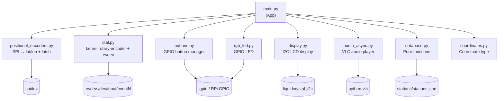

# RadioGlobe Architecture

This document is a guide for developers joining the project. It explains the physical hardware, how the software maps onto it, and what each module does. It also surfaces concrete improvement suggestions to make the code easier to maintain and extend.

This is not the setup guide — that's [README.md](README.md). For a brief asyncio design sketch, see [docs/DESIGN.md](docs/DESIGN.md). For how to submit changes, see [CONTRIBUTING.md](CONTRIBUTING.md).

---

## Table of Contents

1. [What RadioGlobe Is — Physical Context](#1-what-radioglobe-is--physical-context)
2. [Repository Layout](#2-repository-layout)
3. [Architecture Overview](#3-architecture-overview)
4. [Module Reference](#4-module-reference)
5. [Key Data Flows](#5-key-data-flows)
6. [State Management](#6-state-management)
7. [Concurrency Model](#7-concurrency-model)
8. [Configuration Reference](#8-configuration-reference)
9. [Testing](#9-testing)
10. [Contributing](#10-contributing)
11. [Suggested Improvements](#11-suggested-improvements)
12. [What's Already Good](#12-whats-already-good)

---

## 1. What RadioGlobe Is — Physical Context

Before the code makes sense, you need to picture the object.

A physical globe sits in a cradle. The cradle has a pivoting reticule — a crosshair arm — that the user positions over any point on the globe's surface. Two 10-bit absolute rotary encoders read the reticule's latitude and longitude as integer values from 0 to 1023. There is no "home position" — the encoders are absolute, not incremental, so they survive power cycles without recalibration (as long as the globe hasn't been physically moved).

Spinning the globe to point at London causes the software to look up London's radio stations and start playing one. A rotary dial on the base lets the user cycle through stations or cities. Four push-buttons handle volume, calibration, and power. A 20×4 character LCD and an RGB LED provide feedback.

The Raspberry Pi 4B runs Raspberry Pi OS Bookworm Lite. Audio plays through VLC via either the 3.5mm jack or Bluetooth.

### Hardware-to-Module Mapping

| Physical Component | Interface | GPIO / Address | Module |
|---|---|---|---|
| Globe reticule encoders (lat, lon) | SPI bus 0, devices 0 & 1 | — | `positional_encoders.py` |
| Station/city select dial | GPIO quadrature (kernel `rotary_encoder` driver + evdev) | Pins 17 (clock), 18 (direction) | `dial.py` |
| Jog button (mode toggle) | GPIO | Pin 27 | `buttons.py` |
| Top button (volume up) | GPIO | Pin 5 | `buttons.py` |
| Mid button (calibrate / shutdown) | GPIO | Pin 6 | `buttons.py` |
| Bottom button (volume down) | GPIO | Pin 12 | `buttons.py` |
| 20×4 character LCD | I2C | Bus 1, address 0x27 | `display.py` |
| RGB status LED | GPIO | R=22, G=23, B=24 | `rgb_led.py` |
| Audio output | VLC / PulseAudio | 3.5mm / Bluetooth | `audio_async.py` |

### Button Operations

| Button | Short Press | Long Press |
|---|---|---|
| **Jog** (27) | Toggle station / city mode | — |
| **Top** (5) | Volume +10 | Set volume to 80 |
| **Mid** (6) | Calibrate encoders to 0,0 | Shutdown (`sudo poweroff`) |
| **Bottom** (12) | Volume −10 | Mute (volume to 0) |

---

## 2. Repository Layout

```
RadioGlobe/
├── radioglobe/                       # Python application package
│   ├── main.py                       # App class: entry point and main loop
│   ├── radio_config.py               # Configuration constants (see caveat in §8)
│   ├── database.py                   # Pure functions: station/city spatial index
│   ├── coordinates.py                # Coordinate value object (lat/lon → display string)
│   ├── audio_async.py                # AudioPlayer: wraps python-vlc directly
│   ├── display.py              # 20×4 I2C LCD driver
│   ├── dial.py                 # evdev reader for kernel rotary-encoder device (station/city dial)
│   ├── dial_button.py (deleted)          # Combined dial + button (historical, unused in prod)
│   ├── positional_encoders.py  # SPI encoders → lat/lon + latch mechanism
│   ├── buttons.py              # Multi-button manager with short/long press
│   ├── rgb_led.py              # RGB LED flash controller
│   └── streaming/                    # Lab: historical streaming implementations
│       ├── streaming.py              # Oldest: subprocess + amixer volume
│       ├── streaming_cvlc.py         # cvlc subprocess wrapper (used in test scripts)
│       ├── python_vlc_streaming.py   # python-vlc Streamer class (informed audio_async.py)
│       ├── async_streamer.py         # Experimental: async playlist resolver via aiohttp
│       └── files.py                  # JSON loader helper for test scripts
│
├── tests/                            # Mix of unit tests and hardware integration scripts
│   ├── get_stations_by_city_test.py  # Unit tests (run without hardware)
│   ├── simulation_test.py            # Integration: requires Pi hardware
│   ├── async_streamer_test.py        # Integration: requires network
│   └── ...                           # Other hardware / manual test scripts
│
├── stations/
│   └── stations.json                 # Radio station database (~705 KB, 500+ cities)
│
├── services/
│   └── radioglobe.service            # systemd user service definition
│
├── docs/
│   └── DESIGN.md                     # Asyncio design notes
│
├── board/                            # PCB Gerber files and schematics
├── pyproject.toml                    # Package config and dev dependencies
├── requirements.txt                  # Runtime dependencies (includes git-sourced packages)
├── Makefile                          # Build, deploy, release targets
└── install.sh                        # Installation script for Raspberry Pi
```

**Key notes:**
- `streaming/` is a development lab. The production audio code is `audio_async.py`, which does not import from `streaming/`.
- `tests/` contains unit tests (runnable on any machine) alongside `tests/integration/`, which holds the hardware integration scripts.

---

## 3. Architecture Overview

The application is a single-process asyncio program. One event loop runs on the main thread, and all hardware I/O runs as asyncio Tasks or is bridged into the loop from GPIO interrupt threads.

**The central concept is the reticule position.** `PositionalEncoders.run_encoder()` polls SPI every 50ms. While unlatched, every successful reading sets an `asyncio.Event` (`encoders.updated`); the `_encoder_loop()` task wakes on that event, searches the spatial city index for any city near the current position, and if one is found, latches and starts playing its radio stream. Once latched, the event only fires again when the reticule drifts far enough to unlatch. The dial and buttons adjust the experience once a city is latched.

**Two operating modes** are toggled by the jog button:
- `station` mode — the dial cycles through stations within the current city
- `city` mode — the dial cycles through other nearby cities, reloading the first station for each

**The latch mechanism** prevents jitter. Once a city is found, the encoder's raw position is frozen until the user moves the reticule more than `STICKINESS` encoder steps away. Without this, the station would change continuously while the user browses with the dial.

### Module Dependency Graph


```mermaid
graph TD
    main["main.py\n(App)"]

    main --> positional["positional_encoders.py\nSPI → lat/lon + latch"]
    main --> dial["dial.py\nkernel rotary-encoder + evdev"]
    main --> buttons["buttons.py\nGPIO button manager"]
    main --> display["display.py\nI2C LCD display"]
    main --> led["rgb_led.py\nGPIO LED"]
    main --> audio["audio_async.py\nVLC audio player"]
    main --> database["database.py\nPure functions"]
    main --> coordinates["coordinates.py\nCoordinate type"]

    database --> stations[("stations/stations.json")]
    audio --> vlc[("python-vlc")]
    positional --> spidev[("spidev")]
    display --> i2c[("liquidcrystal_i2c")]
    buttons --> gpio[("lgpio / RPi.GPIO")]
    dial --> input[("evdev /dev/input/eventN")]
    led --> gpio
```

The `streaming/` directory is intentionally omitted — none of its modules are imported by the main application.

---

## 4. Module Reference

### 4.1 `main.py` — App Controller

The `App` class is the central controller. `__init__` instantiates all hardware objects and loads the station database. `run()` wires up button definitions, restores any saved state, and then starts and gathers the `_encoder_loop()` and `_dial_loop()` tasks — these two event-driven loops are the app's actual "main loop."

**State** is held in an `AppState` dataclass (`self.state`) with six fields. `save_state()` uses `dataclasses.asdict(self.state)` for serialisation; `load_state()` reconstructs `AppState(...)` directly from the JSON. On boot, if a saved state is found, the latch is restored and the last station resumes playing immediately (warm-restart path).

**Key methods:**

| Method | Purpose |
|---|---|
| `run()` | Restore saved state, then start and gather `_encoder_loop()` and `_dial_loop()` |
| `_encoder_loop()` | Wake on `encoders.updated`, search for nearby cities, latch and start playback when one is found |
| `_dial_loop()` | Wake on `dial.queue`, navigate stations/cities and update playback |
| `next_station(direction)` | Cycle `jog_idx` within `self.state.stations` |
| `next_city(direction)` | Cycle `jog_idx` within `self.state.cities`, reload station list |
| `switch_mode()` | Toggle `self.state.mode` between `"station"` and `"city"` |
| `save_state()` | Serialise `AppState` + encoder offsets to `~/cache/radioglobe.json` |
| `load_state()` | Restore state from cache on startup |
| `_get_coords_by_city(city)` | Look up a `Coordinate` for a city string |
| `_update_volume(delta)` | Adjust volume by delta, briefly show level on display |
| `_update_volume_level(level)` | Set volume to an absolute level, briefly show on display |
| `_start_monitor_stream(url)` | Cancel any running monitor task, start a fresh `_monitor_stream` task, store the handle |
| `_monitor_stream(expected_url)` | Check VLC state every 3 s; on failure, flash LED red, drop the failed station (`_remove_failed_station()`), and play the next; exits once a station plays cleanly, all stations are exhausted, or the user switches away |
| `_handle_short_jog` / `_handle_long_jog` | Jog button handlers |
| `_handle_short_top` / `_handle_long_top` | Top button handlers |
| `_handle_short_mid` / `_handle_long_mid` | Mid button handlers |
| `_handle_short_bottom` / `_handle_long_bottom` | Bottom button handlers |
| `_on_jog_press` / `_on_sound_press` / `_on_mid_press` | Immediate press-down LED feedback |

**Non-obvious details:**
- `self.state.city` is passed to `display.update()` as a raw string (e.g. `"London,GB"`). The display truncates it to 20 characters before centering.
- `save_state()` always writes `"latch": True`; on `load_state()` this causes the app to immediately resume playing the last station on next boot.
- If the warm-restart state is incomplete (city or station is `None` after `load_state()`), the app logs a warning, clears the latch, and falls back to calibrate mode rather than crashing.

---

### 4.2 `database.py` — Station Data

Pure functions with no side effects and no hardware dependencies. The most testable module in the project.

**Functions:**

| Function | Returns | Notes |
|---|---|---|
| `load_stations(path)` | `dict` keyed by `"City,CC"` | Returns empty dict on FileNotFoundError |
| `build_cities_index(stations_data)` | `dict[(lat_idx, lon_idx) → list[city_name]]` | Converts lat/lon degrees to 0–1023 grid indices; multiple cities per cell are supported |
| `build_look_around_offsets(fuzziness)` | `list` of `(dx, dy)` tuples | Pre-computes the search-zone offset pattern once, at startup (`App.__init__`) |
| `look_around(origin, offsets)` | `list` of `(lat, lon)` tuples | Applies the pre-computed offsets to an origin point — cheap enough to call on every encoder event |
| `find_cities_near(origin, offsets, cities_index)` | `list` of city strings, closest-first | The production city search, called from `_encoder_loop()` in `main.py` |
| `get_stations_by_city(stations, city)` | `list` of `(name, url)` tuples | The canonical station list format |
| `get_found_cities(search_area, city_map)` | `list` of city strings | Used only by integration test scripts; superseded in production by `find_cities_near` |

**Coordinate formula:** `index = round((degrees + 180) * 1024 / 360)`. This maps −180°→0 and +180°→1024.

**`build_look_around_offsets()` detail:** `fuzziness=1` returns just the origin offset; `fuzziness=2` returns 9 offsets (3×3 area); `fuzziness=3` returns 25 offsets (5×5 area) — the app's default (`FUZZINESS = 3`, see [§8](#8-configuration-reference)). The pattern is built innermost-first, so `find_cities_near()` returns matches closest-first. The search starts bottom-left and scans horizontally — this matches ergonomics (70% of people are right-eye dominant and hold the globe below eye level).

**Legacy functions** at the bottom of the file (`get_stations_info`) are not used by the main application — only by integration test scripts.

---

### 4.3 `positional_encoders.py` — Globe Position

Reads two SPI absolute rotary encoders and maintains the current lat/lon position.

**Key behaviour:**
- Each encoder is read via SPI bus 0, device 0 (latitude) and device 1 (longitude), at 1,000,000 Hz, SPI mode 1 — the datasheet maximum for the Bourns EMS22A50-D28-LT6 (raised from an original 5000 Hz; see `docs/KERNEL_ROTARY_ENCODER_INVESTIGATION.md`).
- Raw readings are 16 bits; the top 10 bits (after shifting right by 6) give the 0–1023 position.
- `check_parity()` validates each reading. If parity fails, the entire read returns `None` and is discarded.
- Latitude is inverted: `readings[0] = ENCODER_RESOLUTION - readings[0]`. This corrects for encoder mounting orientation.
- `run_encoder()` is an event-driven task, not a target the app polls: while unlatched, it sets `self.updated` (an `asyncio.Event`) on every successful read; `main.py`'s `_encoder_loop()` awaits this event instead of polling on its own. Once latched, the event only fires again when the position drifts past `latch_stickiness`.

**The latch mechanism:**
- `latch(lat, lon, stickiness)` stores the latched position and sets `latch_stickiness` to the threshold value.
- While latched, `run_encoder()` still reads SPI but only updates `self.latitude`/`self.longitude` if the new reading differs by more than `latch_stickiness` steps. A deviation must be seen on `UNLATCH_CONFIRM_THRESHOLD` (2) consecutive readings before it actually unlatches — added to stop the faster 50ms poll rate from reacting to single-sample sensor noise (the EMS22A50 datasheet specifies ~0.12° RMS output transition noise) as if it were real movement. Once confirmed, `latch_stickiness` is set to `None` (unlatched) and reading resumes normally.
- `is_latched()` returns `True` if `latch_stickiness is not None`.

**Calibration:** `zero()` sets offsets so the current physical position maps to (512, 512), which corresponds to 0°N, 0°E (the equator / prime meridian intersection). `get_readings()` always returns the offset-adjusted value modulo ENCODER_RESOLUTION. `reset_latch()` clears `latch_stickiness` so `_encoder_loop()` can re-detect cities after zeroing — `zero()` alone does not clear the latch.

---

### 4.4 `dial.py` — Station / City Selector

Reads a quadrature rotary encoder on GPIO pins 17 (clock) and 18 (direction) — but unlike
every other GPIO device in this project, decoding happens in the **kernel**, not in Python.
`install.sh` adds `dtoverlay=rotary-encoder,pin_a=17,pin_b=18,relative_axis=1` to
`/boot/firmware/config.txt`, which binds the stock `drivers/input/misc/rotary_encoder.c`
driver to those two pins. The driver's IRQ handler runs a gray-code state machine that
rejects invalid transition sequences, but — confirmed by a raw on-device event capture,
see `docs/KERNEL_ROTARY_ENCODER_INVESTIGATION.md` §9 — it does **not** fully suppress
mechanical contact bounce, even at the overlay's most conservative `steps-per-period=1`
default: bounce can still produce bursts of several extra same-sign or cancelling
opposite-sign `REL_X` events within a few milliseconds of a single physical click. A
software coalescing layer in `dial.py` (below) filters this out. Investigated in full in
`docs/KERNEL_ROTARY_ENCODER_INVESTIGATION.md` §6 and §9.

- `AsyncDial._find_rotary_device()` locates the resulting `/dev/input/eventN` device via
  `evdev.list_devices()`, matching by capability (`EV_REL`/`REL_X` present, `EV_KEY`
  absent) rather than a hardcoded device name or event-number, so it survives reboots and
  eventN renumbering.
- `start()` registers the device's file descriptor directly on the asyncio event loop with
  `loop.add_reader(fd, callback)` — no background task, no thread pool.
- `_on_readable()` accumulates the signed `REL_X` value of each event into a running sum
  and (re)arms a single `loop.call_later(DIAL_DEBOUNCE_S, self._flush)` timer, cancelling
  and rescheduling it on every new event — so the timer only fires once the encoder goes
  quiet for `DIAL_DEBOUNCE_S` (`radio_config.py`). `_flush()` then pushes a single
  `_POLARITY * sign(sum)` onto `self.queue` (an `asyncio.Queue[int]`, via `put_nowait`) —
  or nothing at all if the accumulated sum is exactly zero, i.e. a bounce burst that fully
  cancelled itself. A single `_POLARITY` constant corrects for physical wiring, same role
  as the old code's sign inversion.
- `stop()` cancels any pending debounce timer before calling `loop.remove_reader(fd)`,
  which is synchronous and immediate — this fixed a real bug in the old GPIO-based
  version, where `stop()` awaited a task blocked inside
  `asyncio.to_thread(GPIO.wait_for_edge, ...)` and could hang until the next physical edge.
- `main.py`'s `_dial_loop()` is unchanged: it still consumes `await self.dial.queue.get()`
  — both the kernel-driver migration and the bounce-coalescing fix are entirely internal
  to `dial.py`.

---

### 4.5 `buttons.py` — Button Manager

Manages four GPIO buttons with short and long press detection.

**Button definition tuple:**
```python
("Name", gpio_pin, short_handler, long_handler, press_callback)
```
- `press_callback` fires immediately on press-down (used for instant LED feedback)
- `short_handler` fires on release if held < 1.0 second
- `long_handler` fires on release if held ≥ 1.0 second

`AsyncButton` uses GPIO fall-edge callbacks that bridge into the asyncio event loop via `loop.call_soon_threadsafe()`. `AsyncButtonManager` holds all buttons, runs a background polling task, and dispatches events via an `asyncio.Queue`.

---

### 4.6 `display.py` — LCD Display

Drives a 20×4 I2C character LCD at address 0x27 on bus 1, using the `liquidcrystal_i2c` library.

- Internally maintains a 4-line text buffer and an `asyncio.Event` (`changed`). When `update()` or `message()` is called, the buffer is updated and the event is set.
- `_display_loop()` is an asyncio Task that waits for the event, writes all 4 lines to the LCD, and sleeps 100ms. This coalesces rapid updates — important because I2C is slow.
- All strings are truncated to `DISPLAY_COLUMNS` characters before `center()` is applied, so overlong city or station names never overflow the hardware line buffer.

**Display layout when playing:**
```
Line 0: 51.50N, 0.13W        ← Coordinate.__str__()
Line 1: London,GB             ← City name
Line 2: --------              ← Volume bar (ASCII dashes, scales 0–100)
Line 3: BBC Radio 2           ← Station name
```

---

### 4.7 `audio_async.py` — Audio Player

Wraps `python-vlc` directly. Does not import from `streaming/`.

```python
class AudioPlayer:
    def __init__(self):
        self.instance = vlc.Instance(
            "--input-repeat=-1",
            "--network-caching=2000",
        )
        self.player = self.instance.media_player_new()
        self.current_url = None
```

- `play(city, station)` stops any current playback and starts the new URL immediately. VLC handles playlist URLs (`.m3u`, `.pls`) internally. It records `current_url` so `_monitor_stream` can detect when the user has moved to a new station.
- `--input-repeat=-1` means VLC retries the stream automatically if the connection drops.
- `--network-caching=2000` adds a 2 s jitter buffer to absorb network hiccups without triggering error state.
- Volume is managed via VLC's `audio_get_volume` / `audio_set_volume`, range 0–100.
- `is_error()` returns `True` if VLC is in `State.Error` **or** `State.Ended`. Both indicate failure for a live stream: `Error` for codec/protocol failures, `Ended` for HTTP 404 responses.
- Dead-stream detection is handled by `App._monitor_stream(expected_url)` in `main.py`. It checks `is_error()` every 3 s. On failure it flashes the LED red, removes the failed station from the session list (`_remove_failed_station()`), and immediately plays and displays the next station — looping until one plays cleanly, all stations for the city are exhausted, or the user selects something else, at which point the loop exits silently.

---

### 4.8 `rgb_led.py` — Status LED

Three GPIO output pins (R=22, G=23, B=24) with simple on/off control (no PWM).

`led_task(led, led_running, colour, duration)` is a standalone coroutine, always spawned with `asyncio.create_task()` rather than awaited. It:
1. Checks the `led_running` Event to prevent overlapping flashes
2. Sets the event, turns the LED on
3. Sleeps for `duration` seconds
4. Turns the LED off and clears the event

**Colour conventions used in `main.py`:**
- Green: city found/latched, button press feedback
- Blue: dial turned, volume button press

---

### 4.9 `coordinates.py` — Coordinate Type

A simple value object. `__str__` produces the display format used on the LCD:

```python
>>> str(Coordinate(51.5074, -0.1278))
'51.51N, 0.13W'
```

Equality comparison rounds to 2 decimal places (`ROUNDING = 2`). Used consistently throughout `main.py` and `display.py` — all `display.update()` call sites pass a `Coordinate` object.

---

### 4.10 `radio_config.py` — Configuration

Defines constants for the application. **Warning: many of these are not actually used.** See [§8 Configuration Reference](#8-configuration-reference) for the full discrepancy table.

No side-effects on import — it is a constants-only module. Logging is configured in `main.py`'s `__main__` block.

---

### 4.11 `streaming/` — Historical Streaming Implementations

This directory contains four streaming approaches developed over time. None are imported by the production code (`audio_async.py`).

| File | Approach | Status |
|---|---|---|
| `streaming.py` | subprocess + amixer volume | Legacy |
| `streaming_cvlc.py` | `cvlc` CLI subprocess | Used in integration test scripts |
| `python_vlc_streaming.py` | python-vlc with explicit playlist detection | Informed `audio_async.py` design |
| `async_streamer.py` | Async playlist URL resolver using aiohttp | Experimental, not used |
| `files.py` | JSON station loader helper | Used by test scripts |

If you need to understand the audio subsystem, read `audio_async.py`. The `streaming/` directory is useful historical context.

---

## 5. Key Data Flows

### Flow A: Globe Spun to a New City

1. `PositionalEncoders.run_encoder()` polls SPI every 50ms. While unlatched, each successful read sets `encoders.updated` (an `asyncio.Event`).
2. `_encoder_loop()` wakes on that event, clears it, and calls `encoders.get_readings()` — returns the offset-adjusted `(lat, lon)` tuple.
3. `find_cities_near(coords, self.look_around_offsets, self.cities_info)` applies the pre-computed offset pattern — 25 points (5×5 area) for the default `FUZZINESS = 3` — and returns matching cities, closest-first.
4. If cities are found and the encoders are not already latched:
   - `encoders.latch(*coords, stickiness=STICKINESS)` freezes the position.
   - `jog_idx` resets to 0.
   - The LED flashes green.
5. `get_stations_by_city(self.stations_info, city)` fetches the station list as `[(name, url), ...]`.
6. `audio_player.play(city, station)` passes the URL to VLC.
7. `display.update(coords, city, 0, station_name, False)` refreshes the LCD.
8. `_start_monitor_stream(station_url)` cancels any previous monitor and starts a new one, which checks playback every 3 s and switches to the next station on failure.

### Flow B: User Turns the Dial

1. The kernel's `rotary_encoder` driver decodes GPIO 17/18 transitions and emits an `EV_REL`/`REL_X` evdev event; `AsyncDial`'s `loop.add_reader` callback reads it and pushes the direction onto `dial.queue`.
2. `_dial_loop()` wakes with `await self.dial.queue.get()` — no polling.
3. The LED flashes blue.
4. If `mode == "station"`: `next_station(direction)` increments/decrements `jog_idx` within `self.stations` (wraps around).
5. If `mode == "city"`: `next_city(direction)` increments/decrements `jog_idx` within `self.cities`, fetches the first station for the new city.
6. `display.update()` and `audio_player.play()` update immediately.

---

## 6. State Management

Application state is held in an `AppState` dataclass on `self.state`:

| Field | Type | Meaning |
|---|---|---|
| `stations` | `list[(name, url)]` | Stations for the current city |
| `station` | `tuple \| None` | Currently playing station |
| `cities` | `list[str]` | Cities found in the current search zone |
| `city` | `str \| None` | Currently selected city (e.g. `"London,GB"`) |
| `jog_idx` | `int` | Shared index used by both station and city navigation |
| `mode` | `str` | `"station"` or `"city"` |

Encoder state (lat/lon, offsets, latch) is owned by `PositionalEncoders` on `self.encoders`.

On shutdown (long press of mid button), `save_state()` calls `dataclasses.asdict(self.state)` and appends the encoder offsets and latch flag, writing the result to `~/cache/radioglobe.json`. On the next boot, `load_state()` reconstructs `AppState(...)` from the JSON, then immediately re-queries `get_stations_by_city()` from the live database. It matches the saved station by name; if not found it falls back to index 0. This means a `stations.json` update between boots never causes a wrong URL or stale index.

---

## 7. Concurrency Model

The entire application runs on a single asyncio event loop, made up of several independent, event-driven tasks rather than one polling "main loop." Understanding this is essential before modifying any hardware module.

**Tasks running concurrently (started from `run()` and component `start()` calls):**
```python
# dial.start() is NOT a task — it's a loop.add_reader(fd, callback) registration.
# The kernel's rotary_encoder driver does the decode/debounce; the event loop invokes
# the callback directly whenever the evdev fd is readable, pushing to dial.queue.
asyncio.create_task(encoders.run_encoder())          # polls SPI every 50ms, sets encoders.updated
asyncio.create_task(display._display_loop())         # writes LCD on `changed` event
asyncio.create_task(button_manager._poll_buttons())  # polls button state every 50ms, pushes to event_queue
asyncio.create_task(button_manager.handle_events())  # dispatches queued button events
asyncio.create_task(self._encoder_loop())            # wakes on encoders.updated — latches cities
asyncio.create_task(self._dial_loop())               # wakes on dial.queue — navigates stations/cities
```
`run()` only awaits the last two (`await asyncio.gather(encoder_task, dial_task)`); the others run in the background for the app's lifetime.

**GPIO interrupt bridging:** RPi.GPIO fires button callbacks on a separate interrupt thread. These callbacks call `loop.call_soon_threadsafe(...)` to schedule coroutines back onto the asyncio event loop. This is the correct pattern — do not call `asyncio.create_task()` directly from a GPIO callback thread.

**Blocking calls:** `GPIO.wait_for_edge()` is blocking and is wrapped with `asyncio.to_thread()` in `buttons.py`'s underlying GPIO callback dispatch. Any new hardware code that polls with blocking calls must do the same. For anything that exposes a pollable file descriptor instead (evdev devices, sockets, pipes), prefer `loop.add_reader(fd, callback)` — this is what `dial.py` now does, avoiding a thread entirely rather than wrapping a blocking call in one.

**LED tasks** are always `create_task`'d rather than awaited — they are fire-and-forget. The `led_running` Event prevents concurrent flashes.

**What to be careful about:** Do not put any blocking call (file I/O, `time.sleep()`, synchronous network calls) directly in any of these loop bodies. Every blocking call holds up all other hardware tasks.

---

## 8. Configuration Reference

Most constants are defined in `radio_config.py` and imported where used, with no dead
constants and no import side-effects. A few reticule/globe encoder timing values are
hardcoded directly in `positional_encoders.py` instead (noted below) rather than routed
through `radio_config.py`.

| Parameter | Value | Where used |
|---|---|---|
| `FUZZINESS` | 3 | `main.py` — 25-point (5×5) search zone |
| `STICKINESS` | 2 | `main.py` — unlatch threshold in encoder steps |
| `ENCODER_RESOLUTION` | 1024 | `database.py`, `positional_encoders.py` |
| `VOLUME_STEP` | 10 | `main.py` — `_handle_short_top` / `_handle_short_bottom` |
| `STATE_CACHE_PATH` | `"~/cache/radioglobe.json"` | `main.py` — `save_state()` and `load_state()` |
| `DIAL_DEBOUNCE_S` | 0.03 | `dial.py` — `AsyncDial._on_readable()`/`_flush()`; coalesces bursts of kernel `REL_X` events (contact bounce) into a single net direction per physical click |
| GPIO pin numbers | `PIN_DIAL_CLOCK`, `PIN_BTN_*`, `PIN_LED_*` | Each hardware module. `PIN_DIAL_CLOCK`/`PIN_DIAL_DIR` are also duplicated as literal pin numbers in `install.sh`'s `dtoverlay=rotary-encoder,pin_a=17,pin_b=18,...` line — nothing enforces these two stay in sync if the constants ever change |
| I2C address | `I2C_LCD_ADDR = 0x27` | `display.py` |
| SPI poll interval | 50ms (`asyncio.sleep(0.05)`) | `positional_encoders.py` — `run_encoder()`; hardcoded, not in `radio_config.py`. Raised from an original 200ms — see `docs/KERNEL_ROTARY_ENCODER_INVESTIGATION.md` |
| SPI clock speed | `max_speed_hz = 1000000` | `positional_encoders.py` — `read_spi()`; hardcoded, not in `radio_config.py`. Raised from an original 5000 Hz to the Bourns EMS22A50-D28-LT6 datasheet maximum |
| `UNLATCH_CONFIRM_THRESHOLD` | 2 | `positional_encoders.py` class constant — consecutive out-of-band readings required before unlatching, added to filter sensor noise at the faster poll rate |

---

## 9. Testing

Unit tests run on any machine. Hardware integration scripts require a connected Raspberry Pi.

**Unit tests (run without hardware):**
```bash
uv run pytest
```
`pyproject.toml` configures `testpaths = ["tests"]` and `norecursedirs = ["integration"]`, so `pytest` finds only the unit tests and skips the hardware scripts automatically.

**Hardware / integration scripts** live in `tests/integration/` and must be run directly on the Pi from the `radioglobe/` directory:

| Script | What it tests |
|---|---|
| `button_test.py` | GPIO button short/long press detection — `python ../tests/integration/button_test.py mid` |
| `dial_test.py` | Kernel rotary-encoder evdev device discovery and direction detection |
| `positional_encoders_test.py` | SPI encoder reading and latch mechanism |
| `simulation_test.py` | End-to-end main loop simulation |
| `async_streamer_test.py` | Async playlist resolver (requires network) |
| `streaming_cvlc_test.py` | cvlc subprocess streaming |

---

## 10. Contributing

Branching, PR, and release conventions live in [CONTRIBUTING.md](CONTRIBUTING.md) — feature branches off `develop`, PRs into `develop`, releases cut from `master` via the `Makefile` version bump targets.

---

## 11. Suggested Improvements

These are ordered from lowest to highest effort. None require a rewrite — all are incremental changes.

---

### Improvement A: `IndexError` if a city has no stations at latch time

**Problem:** In the latch block in `_encoder_loop()`:
```python
self.state.stations = get_stations_by_city(self.stations_info, self.state.city)
self.state.station = self.state.stations[0]   # IndexError if list is empty
```
If a city key exists in `stations.json` but its station list is empty (malformed entry, partial database update), this raises an unhandled `IndexError` that crashes the `_encoder_loop()` task (and, via the second call site below, `_dial_loop()`).

The same unguarded pattern exists in `_dial_loop()`, after `next_city()`:
```python
self.next_city(direction)
self.state.station = self.state.stations[0]   # IndexError if list is empty
```

**Fix:** Guard before indexing at both call sites:
```python
if not self.state.stations:
    logging.warning(f"No stations for {self.state.city!r} — skipping latch")
    self.encoders.reset_latch()
else:
    self.state.station = self.state.stations[0]
    # ... display, play, monitor
```

**Effort:** 15 minutes.

---

### Improvement B: `save_state()` serialises `stations` and `cities` snapshots that are ignored on restore

**Problem:** `save_state()` uses `dataclasses.asdict(self.state)`, which includes `stations` (a list of `(name, url)` tuples for the current city) and `cities` (all cities found in the search zone at latch time). Both can be large. `load_state()` re-queries `stations` from the live database on startup, and `cities` is repopulated by `_encoder_loop()` the next time `encoders.updated` fires — so the saved values are read from JSON and immediately discarded. They bloat the cache file for no benefit.

**Fix:** Build the dict manually in `save_state()`, omitting the two lists:
```python
state = {
    "station": list(self.state.station) if self.state.station else None,
    "city": self.state.city,
    "jog_idx": self.state.jog_idx,
    "mode": self.state.mode,
    "lat": self.encoders.latitude,
    ...
}
```

**Effort:** 15 minutes.

---

### Improvement C: Volume display updates can be overwritten by a concurrent display update

**Problem:** `_update_volume()` calls `display.update()`, then `await asyncio.sleep(0.5)`, then calls `display.update()` again to clear the volume bar. During the 0.5 s yield, `_encoder_loop()` or `_dial_loop()` may also call `display.update()` — for example if a city is freshly latched while the volume overlay is showing. The second volume call then overwrites that update with a stale "volume cleared" view.

This is cosmetic and non-crashing, but the display momentarily shows the wrong city or station after the sleep. A fix requires either a timestamp/generation counter to skip the second update if the display has moved on, or removing the two-call pattern entirely in favour of a timed overlay in `_display_loop`.

**Effort:** 30–60 minutes.

---

## 12. What's Already Good

**`database.py` pure-function design.** All station and city lookups are stateless functions with no hardware dependencies. They're unit-testable without mocking anything and straightforward to reason about. The one-time index build at startup (`build_cities_index`) is the right trade-off — it makes every city lookup in `_encoder_loop()` O(1).

**The spatial search approach.** Building a 1024×1024 grid dict at startup and doing dict lookups in `find_cities_near()` is efficient and simple. `build_look_around_offsets()` with fuzziness is the right way to handle the physical imprecision of pointing at a globe.

**The asyncio architecture is fundamentally sound.** GPIO interrupt callbacks are correctly bridged back to the event loop via `call_soon_threadsafe`. Blocking GPIO calls are wrapped in `asyncio.to_thread` — `dial.py` is the one exception, since it reads a pollable evdev fd via `loop.add_reader` instead of a blocking GPIO call, needing neither a thread nor `call_soon_threadsafe`. Event-driven waits (`encoders.updated`, `dial.queue`) mean idle tasks cost nothing, rather than burning CPU on a fixed-interval poll.

**The latch mechanism.** Freezing the encoder position until the user moves significantly is a genuinely clever UX solution. Without it, browsing stations while holding the globe still would be impossible — any tiny vibration would trigger a city change.

**Display update coalescing.** The buffer + `asyncio.Event` pattern in `display.py` correctly batches rapid updates. I2C is slow (~100µs per byte); writing all 4 LCD lines takes several milliseconds, so coalescing is not just an optimisation — it's necessary for responsiveness.

**The systemd user service** (not system service) is the correct approach for an application that uses PulseAudio. PulseAudio runs per-user; a system service cannot see the user's audio session. Running as the logged-in user (with `loginctl enable-linger`) is the only reliable way to get auto-detected audio outputs including Bluetooth.
